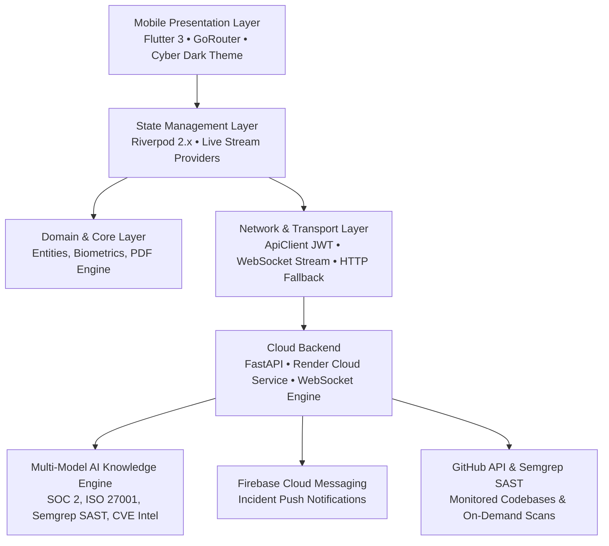

# SecurePulse 🛡️⚡

[](https://flutter.dev)
[](https://dart.dev)
[](https://fastapi.tiangolo.com)
[](https://firebase.google.com)
[](LICENSE)

**SecurePulse** is a next-generation enterprise cybersecurity and SOC mobile operations platform built for security analysts, incident responders, and CISOs. Designed with a high-contrast dark cyberpunk aesthetic, hardware-backed biometric security, live WebSocket threat streaming, dynamic AI security assistance, real GitHub SAST repository scans, and one-tap executive PDF compliance report exports.

---

## 🌟 Architecture & Tech Stack



### Core Technologies
- **Mobile Frontend**: Flutter 3 (Dart 3), Riverpod State Management, GoRouter, `flutter_animate`, `fl_chart`.
- **Cloud Backend**: Python 3.11, FastAPI, Uvicorn, WebSockets, JWT Authentication, Render Cloud.
- **Push Notification Pipeline**: Google Firebase Cloud Messaging (FCM) & `firebase_admin` SDK.
- **Document Engine**: Pure vector `pdf` engine with native `share_plus` and `path_provider` export.
- **Hardware Security**: `local_auth` biometric authentication (Fingerprint / Face ID).

---

## 🛡️ Key Platform Capabilities

### 1. 📊 Executive Security Operations Dashboard
- Real-time **Security Posture Score** (94/100, Grade **A+**) with animated gauge rings and vulnerability charts.
- Live system status monitors for Cloud API, WebSockets, GitHub integration, and AI engine.
- Instant access to quick actions: One-tap SAST scans, SOC incident triage, AI chat, and compliance reports.

### 2. ⚡ Real-Time WebSocket SOC Threat Streaming
- Subscribes to live WebSocket telemetry (`wss://.../ws/alerts`) for instant incident detection.
- Resilient architecture with **automatic HTTP long-polling fallback** if network proxies block raw sockets.
- Incident severity badges (Critical, High, Medium, Low), attack vector classifications, and IP origin telemetry.

### 3. 🔍 GitHub Repository Integration & Live SAST Scans
- Monitored codebases include **`NATTOMR/secureguard-mobile`** and **`NATTOMR/secureguard-backend`**.
- One-tap **"Trigger Immediate SAST Scan"** dispatches real-time Semgrep & Secret scanning across cloud repositories.
- Live telemetry sync updates repository health grades and findings counts on your phone.

### 4. 🤖 Dynamic AI Security Copilot (`SecurePulse AI Agent`)
- Expert cybersecurity knowledge engine for **SOC 2 Type II**, **ISO/IEC 27001:2022**, and zero-day threat patches.
- Generates tailored remediation patches, `iptables`/`ufw`/Cloudflare firewall rules, and custom Semgrep YAML rules.

### 5. 📄 Executive PDF Compliance Report Export
- One-tap generation of official audit PDFs for:
  - **SOC 2 Type II** (Trust Services Criteria CC6.1 - CC8.1)
  - **ISO/IEC 27001:2022** (Annex A.5 - A.8)
  - **PCI-DSS v4.0** & **HIPAA Security Rule**
- Includes cryptographic SHA256 audit verification stamps and direct export via the native Android Share Sheet (Email, Slack, WhatsApp, Google Drive).

### 6. 🎨 Custom Cyber Shield Launcher & Splash Branding
- Custom dark obsidian metallic app icon with a **neon cyan holographic cyber defense shield and circuit lock core**.
- Android adaptive launcher icons (`mdpi`, `hdpi`, `xhdpi`, `xxhdpi`, `xxxhdpi`) and shimmering animated splash screen.

---

## 📂 Project Directory Structure

```
secureguard-mobile/
├── android/                   # Android native configuration & Gradle scripts
│   ├── app/
│   │   ├── google-services.json # Firebase configuration
│   │   └── src/main/res/      # Custom adaptive cyber launcher icons
├── assets/
│   └── images/                # High-resolution app icon & branding assets
├── lib/
│   ├── app.dart               # Root MaterialApp & theme configuration
│   ├── main.dart              # App initialization (Firebase, Biometrics, Logging)
│   ├── core/                  # Core infrastructure layer
│   │   ├── config/            # Environment & backend URL configurations
│   │   ├── constants/         # AppColors, AppStrings, AppAssets
│   │   ├── network/           # ApiClient (JWT auto-auth), WebSocketService (with fallback)
│   │   ├── router/            # GoRouter with bottom navigation shell
│   │   ├── services/          # BiometricService, NotificationService, ReportPdfService
│   │   ├── storage/           # SecureStorageService (JWT token storage)
│   │   ├── theme/             # Cyber Dark theme tokens & Google Fonts
│   │   └── widgets/           # SGCard, SGButton, SGAppBar, SGStatisticCard, etc.
│   ├── features/              # Feature-First modular architecture
│   │   ├── ai/                # SecurePulse AI Agent chat screen & repository
│   │   ├── alerts/            # SOC incident alerts & incident detail investigation
│   │   ├── auth/              # Login screen with GitHub, Email, Biometric auth
│   │   ├── dashboard/         # Executive security dashboard & charts
│   │   ├── findings/          # Vulnerability findings & severity filters
│   │   ├── profile/           # Analyst profile & credentials
│   │   ├── reports/           # Executive compliance reports & PDF export
│   │   ├── repositories/      # Monitored codebases & SAST scan triggers
│   │   ├── scans/             # Scan history & detailed log viewer
│   │   ├── settings/          # Environment switching & platform settings
│   │   └── splash/            # Branded animated splash screen
│   └── providers/             # Riverpod providers & live stream notifiers
└── test/                      # Unit & integration test suite (15/15 passing)
```

---

## 📚 Complete Documentation Suite

Comprehensive technical, architectural, and operational documentation is available in the [`docs/`](docs/) directory and compiled to high-fidelity PDF dossiers:

| Document | PDF Dossier | Description |
| :--- | :---: | :--- |
| 📋 [**Project Technical Report**](docs/PROJECT_REPORT.md) | [📄 PDF](docs/PROJECT_REPORT.pdf) | Master academic & technical report covering all 12 chapters, STRIDE threat model, and test results. |
| 🔍 [**Documentation Status & Master Audit**](docs/DOCUMENTATION_STATUS.md) | [📄 PDF](docs/DOCUMENTATION_STATUS.pdf) | Ground-truth engineering audit validating all 16 components against the actual codebase. |
| 📋 [**Evidence Index & Register**](docs/EVIDENCE_INDEX.md) | [📄 PDF](docs/EVIDENCE_INDEX.pdf) | Master checklist indexing 48 evidence items (screenshots, code snippets, logs, videos, diagrams). |
| 📖 [**Technical Walkthrough & Operations**](docs/WALKTHROUGH.md) | [📄 PDF](docs/WALKTHROUGH.pdf) | 30-section step-by-step engineering deployment and analyst operations manual. |
| 🗺️ [**Product & Engineering Roadmap**](docs/ROADMAP.md) | [📄 PDF](docs/ROADMAP.pdf) | Authoritative 17-phase development lifecycle and status delivery matrix. |
| 🧠 [**Master Architecture Mindmap**](docs/MINDMAP.md) | [📄 PDF](docs/MINDMAP.pdf) | Visual 8-branch Mermaid mindmap, component hierarchy topology, and verification matrix. |

---

## 🚀 Getting Started

### Prerequisites
- [Flutter SDK](https://docs.flutter.dev/get-started/install) `>=3.0.0`
- [Dart SDK](https://dart.dev/get-dart) `>=3.0.0`
- Android Studio / Android SDK Platform 34+

### Setup & Run
```bash
# 1. Clone repository
git clone https://github.com/NATTOMR/secureguard-mobile.git
cd secureguard-mobile

# 2. Fetch dependencies
flutter pub get

# 3. Run test suite
flutter test

# 4. Run on connected device or emulator
flutter run
```

### Building Release APK
```bash
flutter build apk --release
```
The compiled APK will be generated at `build/app/outputs/flutter-apk/app-release.apk` (and mirrored at `securepulse-release.apk` in the root folder).

---

## ☁️ Backend Cloud Endpoints

The mobile app connects to the live **SecurePulse Cloud Service** hosted on Render:

| Endpoint | Method | Description |
| :--- | :---: | :--- |
| `/v1/auth/login` | `POST` | Analyst JWT authentication |
| `/v1/dashboard` | `GET` | Overall security posture score & metrics |
| `/v1/alerts` | `GET` | Active SOC security incidents |
| `/ws/alerts` | `WSS` | Real-time WebSocket threat stream |
| `/v1/repositories` | `GET` | Monitored codebases telemetry |
| `/v1/repositories/{id}/scan` | `POST` | Trigger on-demand SAST security scan |
| `/v1/ai/chat` | `POST` | Live AI Security Copilot query |
| `/v1/reports` | `GET` | Executive compliance report logs |

---

## 🔒 Security & Privacy
- **Zero-Trust Client Sessions**: Hardware-backed biometric authentication with auto-expiring JWT bearer tokens.
- **Encrypted Transmission**: All cloud traffic enforced over **TLS 1.3 / WSS** with strict CORS and rate limiting.
- **Push Protection**: Automated secret scanning to prevent credential leakage.

---

## 📄 License
Proprietary Enterprise Software. All rights reserved © 2026 **SecurePulse Security Solutions**.
