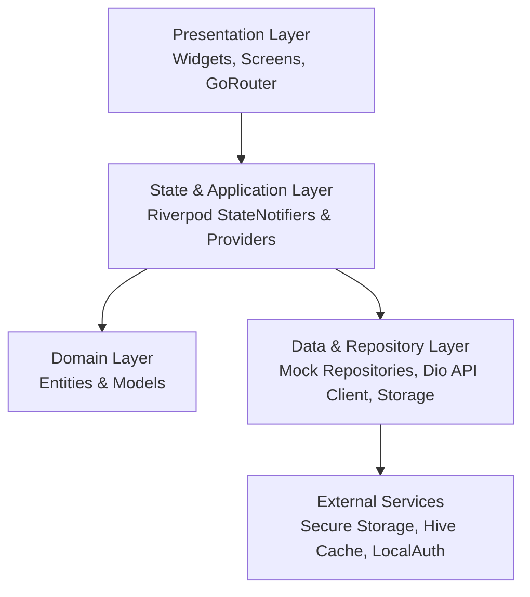
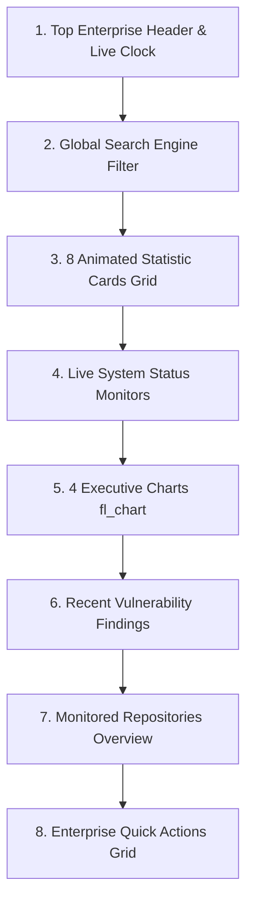

<<<<<<< HEAD
# SecureGuard Mobile 🛡️

Official Android and iOS enterprise mobile application for the **SecureGuard Enterprise Security Platform**. Built with Flutter 3, Dart 3, Clean Architecture, and Riverpod state management.

---

## 🌟 Architecture Overview

`secureguard_mobile` follows **Clean Architecture** principles combined with a **Feature-First** modular organization:



---

## 🛡️ Enterprise Cybersecurity Dashboard

The Enterprise Dashboard is inspired by **Microsoft Defender**, **CrowdStrike Falcon**, **Microsoft Sentinel**, **Elastic Security**, and **GitHub Advanced Security**:



### Dashboard UI Components

- **`DashboardCard`**: Premium glassmorphic container with 20px border radius and press scale feedback.
- **`StatisticCard`**: Animated counter metrics card (Repositories, Scans Today, Critical, High, Medium, Low, SOC Alerts, GitHub Issues).
- **`QuickActionCard`**: Tile for launching scan workflows, SOC console, AI Copilot, reports, or settings.
- **`FindingCard`**: Vulnerability finding card with CVSS severity badges, scanner engine tag, and relative timestamps.
- **`RepositoryCard`**: Monitored repository card displaying language dot, visibility badge (Public/Private), risk score, and last scan time.
- **`ChartCard`**: Dark slate wrapper for `fl_chart` graph widgets.
- **`StatusCard`**: Infrastructure monitor displaying operational health (Backend, GitHub, AI, SOC, PostgreSQL) with animated pulsing green dots.

---

## 📂 Folder Structure

```
lib/
├── core/
│   ├── api/          # Dio HTTP client, interceptors, API endpoints, exceptions
│   ├── config/       # Environment configs, feature toggles
│   ├── constants/    # AppColors (Enterprise Dark Theme), AppStrings, AppAssets
│   ├── router/       # GoRouter with ShellRoute bottom navigation
│   ├── services/     # Biometrics (LocalAuth), Push Notifications, Connectivity
│   ├── storage/      # Secure Storage, Encrypted Hive Cache
│   ├── theme/        # Enterprise Dark Theme tokens & Inter Google Fonts
│   ├── utils/        # Formatters, Validators, Loggers
│   └── widgets/      # Handcrafted Enterprise Design System Components:
│                       - DashboardCard
│                       - StatisticCard
│                       - QuickActionCard
│                       - FindingCard
│                       - RepositoryCard
│                       - ChartCard
│                       - StatusCard
│                       - SGCard, SGButton, SGTextField, SGAppBar, SGBottomNavigation, etc.
├── features/
│   ├── splash/         # Animated Shield Logo & auto-nav (2s)
│   ├── authentication/ # GitHub SSO, Email, Offline & Biometric Login
│   ├── dashboard/      # Enterprise Cybersecurity Dashboard (Microsoft Defender & CrowdStrike inspired)
│   ├── repositories/   # Code repositories, health scores, policy checks
│   ├── scans/          # SAST/DAST/Container scan pipeline & detail logs
│   ├── findings/       # Vulnerability findings, CVSS ratings, severity filters
│   ├── ai/             # AI Security Remediation Copilot chat
│   ├── reports/        # Executive compliance & PDF/CSV export history
│   ├── soc/            # Security Operations Center live alert stream
│   ├── notifications/  # Security alert center
│   ├── profile/        # Analyst profile, MFA status & security keys
│   └── settings/       # App preferences, theme & biometric toggles
├── models/             # Immutable Domain Models (DashboardModel, UserModel, ScanModel, etc.)
├── providers/          # Riverpod DI & State Providers
└── repositories/       # Production-ready Mock Repositories (DashboardRepository REST mock)
```

---

## 🎨 Design System & Theme Tokens

- **Primary**: `#2563EB` (Royal Blue)
- **Secondary**: `#1D4ED8` (Deep Blue)
- **Background**: `#020817` (Ultra-Dark Slate)
- **Surface**: `#0F172A` (Slate Dark)
- **Card**: `#1E293B` (Elevated Slate)
- **Success**: `#22C55E` (Emerald Green)
- **Warning**: `#F59E0B` (Amber)
- **Critical**: `#EF4444` (Rose / Red)
- **Typography**: Inter (Google Fonts)
- **Border Radius**: 20.0px

---

## 🚀 Getting Started

### Prerequisites
- Flutter SDK `>=3.0.0`
- Dart SDK `>=3.0.0`

### Setup & Run
```bash
# 1. Fetch dependencies
flutter pub get

# 2. Run the application
flutter run
```
=======
# secureguard-mobile
>>>>>>> 4c50f74dc7f478947c31d6bb7fdd78519307339d
