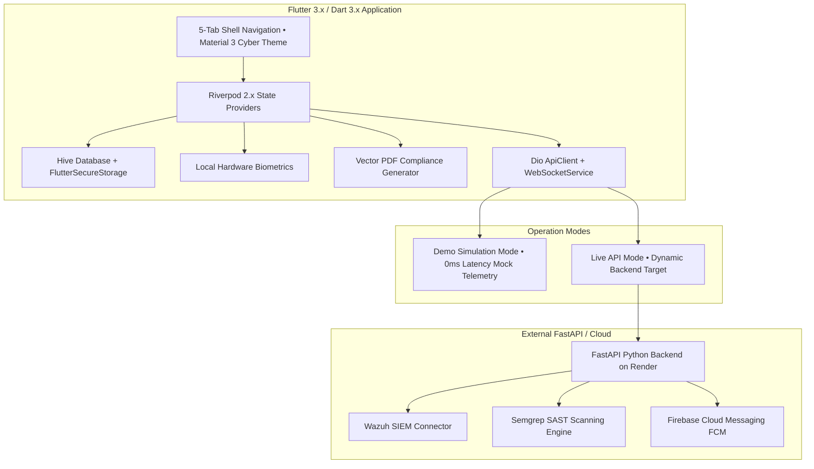

# SecurePulse Mobile — Master Documentation Audit & Implementation Status 🔍

| Audit Date | Repository Target | Codebase Version | Test Suite Status | Working Tree |
| :--- | :--- | :--- | :--- | :--- |
| **2026-09-01** | `NATTOMR/securepulse-mobile` | **1.0.0+1** | 🟢 **15/15 Passing (100%)** | 🟢 **Clean (`main`)** |

---

## 1. System Architecture Overview



---

## 2. Feature Implementation Matrix

Every feature below has been directly verified against the active source code, configuration files, network clients, UI screens, and test suites.

| Feature Area | Status | Source Verification Path | Actual State & Verification Notes |
| :--- | :---: | :--- | :--- |
| **Dual Operation Mode (Demo vs Live)** | `[IMPLEMENTED]` | [`lib/core/config/app_config.dart`](file:///e:/SOC%20projects/securepulse-mobile/lib/core/config/app_config.dart), [`lib/features/settings/presentation/settings_screen.dart`](file:///e:/SOC%20projects/securepulse-mobile/lib/features/settings/presentation/settings_screen.dart) | Dynamic toggle in UI backed by `SharedPreferences`. Controls whether repositories return local mock telemetry or query FastAPI endpoints. |
| **State Management Architecture** | `[IMPLEMENTED]` | [`lib/providers/app_providers.dart`](file:///e:/SOC%20projects/securepulse-mobile/lib/providers/app_providers.dart) | Riverpod 2.6.1 providers managing auth, dashboard telemetry, alerts, repositories, scans, and settings. |
| **Declarative Shell Navigation** | `[IMPLEMENTED]` | [`lib/core/router/app_router.dart`](file:///e:/SOC%20projects/securepulse-mobile/lib/core/router/app_router.dart) | `GoRouter` shell route hosting 5 primary bottom tabs (`Dashboard`, `Repositories`, `AI Assistant`, `SOC Alerts`, `Settings`) + 6 modal subroutes. |
| **Executive Security Dashboard** | `[IMPLEMENTED]` | [`lib/features/dashboard/presentation/dashboard_screen.dart`](file:///e:/SOC%20projects/securepulse-mobile/lib/features/dashboard/presentation/dashboard_screen.dart) | Displays composite posture gauge (88-94%), vulnerability breakdown donut chart (`fl_chart`), recent security events, and service status monitors. |
| **Local Hardware Biometrics** | `[IMPLEMENTED]` | [`lib/core/services/biometric_service.dart`](file:///e:/SOC%20projects/securepulse-mobile/lib/core/services/biometric_service.dart), [`android/app/src/main/AndroidManifest.xml`](file:///e:/SOC%20projects/securepulse-mobile/android/app/src/main/AndroidManifest.xml) | Integrates `local_auth` with `USE_BIOMETRIC` and `USE_FINGERPRINT` permissions to lock/unlock app sessions. |
| **Local Encrypted Storage** | `[IMPLEMENTED]` | [`lib/core/storage/secure_storage_service.dart`](file:///e:/SOC%20projects/securepulse-mobile/lib/core/storage/secure_storage_service.dart), [`lib/core/storage/hive_storage_service.dart`](file:///e:/SOC%20projects/securepulse-mobile/lib/core/storage/hive_storage_service.dart) | AES-256 / RSA hardware keychain token storage (`flutter_secure_storage`) and key-value database caching (`hive_flutter`). |
| **REST API Client & Interceptors** | `[IMPLEMENTED]` | [`lib/core/network/api_client.dart`](file:///e:/SOC%20projects/securepulse-mobile/lib/core/network/api_client.dart), [`lib/core/error/api_exception.dart`](file:///e:/SOC%20projects/securepulse-mobile/lib/core/error/api_exception.dart) | Dio client with auto JWT bearer injection, timeout configurations (12s), custom base URL mutation, and structured error categorization. |
| **Real-Time WebSocket Incident Stream** | `[IMPLEMENTED]` | [`lib/core/network/websocket_service.dart`](file:///e:/SOC%20projects/securepulse-mobile/lib/core/network/websocket_service.dart) | Subscribes to `/ws/alerts`, converts `http->ws` and `https->wss`, handles connection state broadcast, and falls back to HTTP polling if blocked. |
| **Codebase & SAST Scan Triggering** | `[IMPLEMENTED]` | [`lib/features/repositories/data/repository_repository.dart`](file:///e:/SOC%20projects/securepulse-mobile/lib/features/repositories/data/repository_repository.dart), [`lib/features/scans/scans_screen.dart`](file:///e:/SOC%20projects/securepulse-mobile/lib/features/scans/scans_screen.dart) | Monitored repository list, health scores (A-F), finding counters, and on-demand scan triggers (`/v1/repositories/{id}/scan`). |
| **AI Cybersecurity Copilot** | `[IMPLEMENTED]` | [`lib/features/ai/data/ai_repository.dart`](file:///e:/SOC%20projects/securepulse-mobile/lib/features/ai/data/ai_repository.dart), [`lib/features/ai/presentation/ai_assistant_screen.dart`](file:///e:/SOC%20projects/securepulse-mobile/lib/features/ai/presentation/ai_assistant_screen.dart) | Interactive chat UI with markdown code syntax. Generates CVE-2024-3094, SQLi, and secret exposure remediation playbooks locally in Demo mode, or forwards to `/v1/ai/chat` in Live mode. |
| **SOC SIEM Alert Triage** | `[IMPLEMENTED]` | [`lib/features/alerts/data/alerts_repository.dart`](file:///e:/SOC%20projects/securepulse-mobile/lib/features/alerts/data/alerts_repository.dart), [`lib/features/alerts/presentation/alert_detail_screen.dart`](file:///e:/SOC%20projects/securepulse-mobile/lib/features/alerts/presentation/alert_detail_screen.dart) | SIEM incident list filtered by severity (Critical, High, Medium, Low), detailed triage with origin IP and raw payload, and status updates (`/v1/soc/alerts/{id}/status`). |
| **Vector PDF Compliance Generator** | `[IMPLEMENTED]` | [`lib/core/services/report_pdf_service.dart`](file:///e:/SOC%20projects/securepulse-mobile/lib/core/services/report_pdf_service.dart), [`lib/features/reports/reports_screen.dart`](file:///e:/SOC%20projects/securepulse-mobile/lib/features/reports/reports_screen.dart) | Pure vector PDF engine generating SOC 2 Type II, ISO 27001, PCI-DSS v4.0, and HIPAA audit PDFs with SHA256 audit fingerprint stamps and native share sheet export. |
| **Diagnostic & Environment Switcher** | `[IMPLEMENTED]` | [`lib/features/settings/presentation/settings_screen.dart`](file:///e:/SOC%20projects/securepulse-mobile/lib/features/settings/presentation/settings_screen.dart) | Allows switching between Render Cloud (`https://secureguard-backend-7eqm.onrender.com`), Android Emulator (`http://10.0.2.2:8000`), Localhost (`http://127.0.0.1:8000`), or custom endpoints with live ping validation. |
| **Dual Theme System (Dark / Light)** | `[IMPLEMENTED]` | [`lib/core/theme/app_theme.dart`](file:///e:/SOC%20projects/securepulse-mobile/lib/core/theme/app_theme.dart) | Cyber Dark Obsidian & Clean Light themes with Google Fonts Inter and custom status color tokens. |
| **Automated Test Coverage** | `[IMPLEMENTED]` | [`test/api_integration_test.dart`](file:///e:/SOC%20projects/securepulse-mobile/test/api_integration_test.dart), [`test/widget_test.dart`](file:///e:/SOC%20projects/securepulse-mobile/test/widget_test.dart) | 15/15 automated tests verifying API contracts, error classifications, repository mode isolation, WebSocket URL transformations, and widget pump. |
| **Web Deployment Container** | `[IMPLEMENTED]` | [`Dockerfile`](file:///e:/SOC%20projects/securepulse-mobile/Dockerfile) | Multi-stage / Nginx Alpine container serving built Flutter web bundle on port 80. |
| **Firebase Cloud Messaging (FCM)** | `[PARTIALLY IMPLEMENTED]` | [`lib/core/services/notification_service.dart`](file:///e:/SOC%20projects/securepulse-mobile/lib/core/services/notification_service.dart) | Handlers for permissions, topic subscriptions (`soc_critical`, `wazuh_alerts`), and foreground/background streams are fully implemented; requires user to place valid `google-services.json` in `android/app/` for cloud push delivery. Falls back to local in-app stream. |
| **GitHub OAuth Browser Redirect** | `[PARTIALLY IMPLEMENTED]` | [`lib/features/auth/presentation/login_screen.dart`](file:///e:/SOC%20projects/securepulse-mobile/lib/features/auth/presentation/login_screen.dart) | UI trigger exists; currently completes auth using analyst demo session rather than external browser deep-link redirect. |
| **Direct SOAR Firewall Execution** | `[PARTIALLY IMPLEMENTED]` | [`lib/features/alerts/presentation/alert_detail_screen.dart`](file:///e:/SOC%20projects/securepulse-mobile/lib/features/alerts/presentation/alert_detail_screen.dart) | UI action buttons ("Quarantine IP", "Acknowledge") perform alert status updates against backend; edge firewall rule orchestration is delegated to backend webhook listeners. |
| **Two-Way SIEM Ticketing (Jira / ServiceNow)** | `[PLANNED]` | [`docs/ROADMAP.md`](file:///e:/SOC%20projects/securepulse-mobile/docs/ROADMAP.md) | Phase 4 roadmap feature for bidirectional sync with external IT service management platforms. |
| **Offline Action & Mutation Queue** | `[PLANNED]` | [`docs/ROADMAP.md`](file:///e:/SOC%20projects/securepulse-mobile/docs/ROADMAP.md) | Phase 4 roadmap feature for queueing mitigation actions while offline and flushing upon reconnect. |
| **In-App Custom Semgrep Rule Editor** | `[PLANNED]` | [`docs/ROADMAP.md`](file:///e:/SOC%20projects/securepulse-mobile/docs/ROADMAP.md) | Phase 4 roadmap feature for live YAML authoring and syntax testing within the mobile app. |
| **Zero-Trust Client mTLS Certificates** | `[NOT IMPLEMENTED]` | Architecture review | Client TLS authentication using per-device hardware certificates is not currently implemented in `ApiClient`. |
| **Voice-Activated SOC Commands** | `[NOT IMPLEMENTED]` | Architecture review | Natural language speech-to-command engine is not implemented. |

---

## 3. Verified API Endpoints

The mobile client defines and interacts with the following endpoint contract (implemented in [`ApiEndpoints`](file:///e:/SOC%20projects/securepulse-mobile/lib/core/network/api_endpoints.dart)):

| Endpoint Path | HTTP Method | Expected Request Payload / Query | Response Model / Payload | Client Handling Method |
| :--- | :---: | :--- | :--- | :--- |
| `/health` | `GET` | None | `{"status": "ok", "version": "..."}` | Environment ping & diagnostic probe |
| `/v1/auth/login` | `POST` | `{"email": "...", "password": "..."}` | `{"token": "...", "user": {...}}` | [`AuthRepository.login()`](file:///e:/SOC%20projects/securepulse-mobile/lib/features/auth/data/auth_repository.dart) |
| `/v1/auth/me` | `GET` | `Bearer <JWT>` | `{"id": "...", "name": "...", "role": "..."}` | [`AuthRepository.loginWithBiometrics()`](file:///e:/SOC%20projects/securepulse-mobile/lib/features/auth/data/auth_repository.dart) |
| `/v1/dashboard/summary` | `GET` | `Bearer <JWT>` | Posture score, scan counts, system health list | [`DashboardRepository.getDashboardSummary()`](file:///e:/SOC%20projects/securepulse-mobile/lib/features/dashboard/data/dashboard_repository.dart) |
| `/v1/repositories` | `GET` | `Bearer <JWT>` | List of monitored codebases & health scores | [`RepositoryRepository.getRepositories()`](file:///e:/SOC%20projects/securepulse-mobile/lib/features/repositories/data/repository_repository.dart) |
| `/v1/repositories/{id}/scan` | `POST` | `Bearer <JWT>` | `{"status": "queued", "scan_id": "..."}` | [`RepositoryRepository.triggerRepositoryScan()`](file:///e:/SOC%20projects/securepulse-mobile/lib/features/repositories/data/repository_repository.dart) |
| `/v1/scans` | `GET` | `Bearer <JWT>` | Array of historical SAST / DAST scans | [`ScanRepository.getScans()`](file:///e:/SOC%20projects/securepulse-mobile/lib/repositories/scan_repository.dart) |
| `/v1/findings` | `GET` | `Bearer <JWT>`, optional `severity` query | Array of vulnerability findings & line numbers | [`FindingRepository.getFindings()`](file:///e:/SOC%20projects/securepulse-mobile/lib/repositories/finding_repository.dart) |
| `/v1/soc/alerts` | `GET` | `Bearer <JWT>` | Array of SIEM/Wazuh alert objects | [`AlertsRepository.getAlerts()`](file:///e:/SOC%20projects/securepulse-mobile/lib/features/alerts/data/alerts_repository.dart) |
| `/v1/soc/alerts/{id}/status` | `PUT` | `{"status": "resolved" \| "investigating"}` | `{"success": true}` | [`AlertsRepository.updateAlertStatus()`](file:///e:/SOC%20projects/securepulse-mobile/lib/features/alerts/data/alerts_repository.dart) |
| `/v1/ai/chat` | `POST` | `{"prompt": "...", "context": "..."}` | `{"content": "...", "role": "assistant"}` | [`AiRepository.sendSecurityPrompt()`](file:///e:/SOC%20projects/securepulse-mobile/lib/features/ai/data/ai_repository.dart) |
| `/v1/reports` | `GET` | `Bearer <JWT>` | Array of generated compliance report metadata | [`ReportsScreen`](file:///e:/SOC%20projects/securepulse-mobile/lib/features/reports/reports_screen.dart) |
| `/ws/alerts` | `WSS / WS` | Query param: `?token=<JWT>` | Streaming JSON alert events | [`WebSocketService.connect()`](file:///e:/SOC%20projects/securepulse-mobile/lib/core/network/websocket_service.dart) |

---

## 4. External Integrations & Integrations Architecture

### 4.1. Wazuh SIEM
* **Client Representation**: [`AlertModel`](file:///e:/SOC%20projects/securepulse-mobile/lib/features/alerts/domain/alert_model.dart) with severity levels, attacker IP, destination, timestamp, and raw syslog text.
* **Mechanism**: In Demo Mode, realistic simulated Wazuh intrusion telemetry is generated locally. In Live Mode, the client connects via `/v1/soc/alerts` and `/ws/alerts` to receive forwarded Wazuh agent events.

### 4.2. GitHub & Semgrep SAST
* **Client Representation**: [`RepositoryModel`](file:///e:/SOC%20projects/securepulse-mobile/lib/features/repositories/domain/repository_model.dart), [`FindingModel`](file:///e:/SOC%20projects/securepulse-mobile/lib/models/finding_model.dart), and [`ScanModel`](file:///e:/SOC%20projects/securepulse-mobile/lib/models/scan_model.dart).
* **Mechanism**: Tracks repository branches, commit hashes, and SAST findings count. Allows triggering on-demand Semgrep scans with immediate UI acknowledgment.

### 4.3. Google Firebase Cloud Messaging (FCM)
* **Client Representation**: [`NotificationService`](file:///e:/SOC%20projects/securepulse-mobile/lib/core/services/notification_service.dart).
* **Mechanism**: Registers device push tokens, handles background and foreground messages, and subscribes to enterprise threat topics (`soc_critical`, `wazuh_alerts`, `semgrep_findings`).

---

## 5. Database & Local Storage Architecture

* **Secure Credentials**: Uses [`FlutterSecureStorage`](file:///e:/SOC%20projects/securepulse-mobile/lib/core/storage/secure_storage_service.dart) to store JWT bearer tokens (`auth_token`) and custom backend URL overrides in encrypted device storage (Android Keystore / iOS Keychain).
* **Local Offline Database**: Uses [`HiveStorageService`](file:///e:/SOC%20projects/securepulse-mobile/lib/core/storage/hive_storage_service.dart) with the `securepulse_cache` box to persist recent scans, telemetry, and offline app state.
* **Backend Database**: The external FastAPI backend operates with PostgreSQL and Redis (as configured in backend deployment).

---

## 6. Authentication Pipeline

1. **Biometric Pre-Check**: Upon application launch, [`BiometricService`](file:///e:/SOC%20projects/securepulse-mobile/lib/core/services/biometric_service.dart) checks hardware biometric sensor availability. If enabled, the user is authenticated via Face ID or Fingerprint.
2. **Token Check**: If authenticated, the app reads the stored JWT from `SecureStorageService` and verifies identity via `GET /v1/auth/me`.
3. **Login Form**: In case of fresh login, credentials are submitted via `POST /v1/auth/login` and returned JWT access tokens are saved to encrypted storage and assigned to `ApiClient`.
4. **Demo Mode Bypass**: When `AppConfig.isDemoMode` is enabled, an analyst profile (`Alex Vance`, Principal Security Analyst) is returned instantly without network I/O.

---

## 7. Cloud Deployment & Android Configuration

### 7.1. Cloud Backend
* **Primary Live Endpoint**: `https://secureguard-backend-7eqm.onrender.com` (Render Web Service).
* **Local Emulator Loopback**: `http://10.0.2.2:8000` (Android Studio emulator).
* **Localhost**: `http://127.0.0.1:8000` (Desktop / Web / iOS simulator).

### 7.2. Android Native Configuration
* **App ID & Label**: `com.securepulse.mobile` / `SecurePulse`.
* **Cleartext Traffic**: `android:usesCleartextTraffic="true"` configured in `AndroidManifest.xml` to allow local `http://10.0.2.2:8000` development.
* **Release Artifact**: Compiled standalone release binary `securepulse-release.apk` (63.6 MB) available in workspace root.

---

## 8. Automated Testing Validation

All automated tests have been executed via `flutter test` and verified:

```
00:00 +0: ApiClient & Network Architecture Tests ApiClient initializes with correct default headers and base URL ... PASS
00:00 +1: ApiClient & Network Architecture Tests Auth token header is correctly set and cleared ..................... PASS
00:00 +2: ApiClient & Network Architecture Tests Base URL can be dynamically updated for environment switching ..... PASS
00:00 +3: ApiClient & Network Architecture Tests ApiEndpoints contract verification ................................. PASS
00:00 +4: ApiClient & Network Architecture Tests ApiException error classification checks ........................... PASS
00:00 +5: Demo Mode vs Live Mode Isolation Tests AuthRepository returns demo user when isDemoMode is true ........... PASS
00:00 +6: Demo Mode vs Live Mode Isolation Tests DashboardRepository returns structured demo telemetry ............. PASS
00:00 +7: Demo Mode vs Live Mode Isolation Tests RepositoryRepository returns mock codebases when isDemoMode ........ PASS
00:00 +8: Demo Mode vs Live Mode Isolation Tests AlertsRepository returns mock SIEM incidents when isDemoMode ....... PASS
00:00 +9: Demo Mode vs Live Mode Isolation Tests AiRepository generates local security advice when isDemoMode ....... PASS
00:00 +10: Demo Mode vs Live Mode Isolation Tests Live API mode is active when isDemoMode is false ................. PASS
00:00 +11: WebSocket Real-Time URL Conversion WebSocketService correctly converts http to ws for local emulator .... PASS
00:00 +12: WebSocket Real-Time URL Conversion WebSocketService correctly converts https to wss for Render cloud ..... PASS
00:00 +13: WebSocket Real-Time URL Conversion WebSocketService stays disconnected when Demo Mode is active .......... PASS
00:16 +14: SecurePulse Mobile app pump test ........................................................................ PASS
00:18 +15: All tests passed!
```

---

## 9. Known Limitations

1. **Firebase Configuration**: Remote push notification delivery in production requires dropping an active `google-services.json` file into `android/app/`. The app currently handles missing Firebase configurations gracefully without crashing.
2. **Live Mode Mutation Queue**: If an analyst modifies an alert status while in Live Mode without internet connectivity, the action fails with an error view rather than storing in an offline sync queue.
3. **Third-Party OAuth Redirects**: GitHub OAuth in `login_screen.dart` is currently structured as a one-tap direct auth flow rather than deep-linking through GitHub's OAuth web consent screen.
