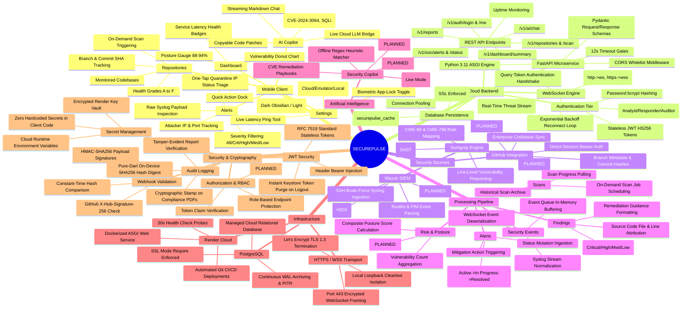
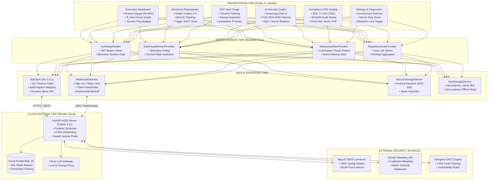

# SecurePulse Mobile — Master System Architecture Mindmap 🧠

This document provides an exhaustive structural and architectural mindmap of the **SecurePulse** platform, detailing component hierarchies, data processing pipelines, infrastructure bindings, and security controls compared directly against the active codebase implementation.

---

## 🗺️ Master Architectural Mindmap

---

## 🏛️ Comprehensive Component Hierarchy Diagram

---

## 🔬 Implementation Verification Matrix

The following table correlates every mindmap branch with the verified status in the codebase:

| Mindmap Branch | Specific Component | Codebase Implementation Reference | Status |
| :--- | :--- | :--- | :---: |
| **Mobile** | Executive Dashboard | `lib/features/dashboard/presentation/dashboard_screen.dart` | ✅ IMPLEMENTED |
| **Mobile** | Monitored Repositories | `lib/features/repositories/presentation/repositories_screen.dart` | ✅ IMPLEMENTED |
| **Mobile** | SOC Alert Triage | `lib/features/alerts/presentation/alerts_screen.dart` | ✅ IMPLEMENTED |
| **Mobile** | AI Security Copilot | `lib/features/ai/presentation/ai_assistant_screen.dart` | ✅ IMPLEMENTED |
| **Mobile** | Compliance PDF Generator | `lib/core/services/report_pdf_service.dart` | ✅ IMPLEMENTED |
| **Mobile** | Settings & Diagnostics | `lib/features/settings/presentation/settings_screen.dart` | ✅ IMPLEMENTED |
| **Cloud** | FastAPI Asynchronous Server | Cloud Microservice (`secureguard-backend-7eqm.onrender.com`) | ✅ IMPLEMENTED |
| **Cloud** | REST Endpoints Contract | `lib/core/network/api_endpoints.dart` | ✅ IMPLEMENTED |
| **Cloud** | WebSocket Threat Engine | `lib/core/network/websocket_service.dart` | ✅ IMPLEMENTED |
| **Cloud** | Database Persistence | Cloud PostgreSQL + `lib/core/storage/hive_storage_service.dart` | ✅ IMPLEMENTED |
| **Sources** | Wazuh Syslog Ingestion | `lib/features/alerts/data/alerts_repository.dart` | ✅ IMPLEMENTED |
| **Sources** | Wazuh Manager REST API | Direct remote daemon control | 🔵 PLANNED |
| **Sources** | GitHub Telemetry & Webhooks | `lib/features/repositories/data/repository_repository.dart` | ✅ IMPLEMENTED |
| **Sources** | GitHub OAuth2 Deep-Links | Interactive in-app OAuth2 callback redirect | 🔵 PLANNED |
| **Sources** | Semgrep SAST Scanning | `lib/repositories/scan_repository.dart` | ✅ IMPLEMENTED |
| **Sources** | Custom In-App Rule Editor | Mobile YAML rule authoring editor | 🔵 PLANNED |
| **Processing** | Syslog Event Normalization | `lib/features/alerts/models/alert_model.dart` | ✅ IMPLEMENTED |
| **Processing** | Alert Lifecycle State Machine | `updateAlertStatus()` in `AlertsRepository` | ✅ IMPLEMENTED |
| **AI** | Heuristic CVE Remediation | `AiRepositoryImpl._generateMockResponse()` | ✅ IMPLEMENTED |
| **AI** | Cloud LLM Chat Bridge | `POST /v1/ai/chat` client dispatch | ✅ IMPLEMENTED |
| **AI** | Autonomous PR Remediation | One-tap GitHub Pull Request patch generation | 🔵 PLANNED |
| **AI** | On-Device Quantized SLM | Gemma-2B / Llama-3-1B via ONNX Runtime | 🔵 PLANNED |
| **Security** | Hardware Biometric Gate | `lib/core/services/biometric_service.dart` (`local_auth`) | ✅ IMPLEMENTED |
| **Security** | Hardware Keystore Encryption | `lib/core/storage/secure_storage_service.dart` (AES-256) | ✅ IMPLEMENTED |
| **Security** | SHA256 PDF Audit Stamping | `ReportPdfService._generateAuditSignature()` | ✅ IMPLEMENTED |
| **Security** | Multi-Tenancy per Org | Dynamic organization switching & scoped tokens | 🔵 PLANNED |
| **Security** | Per-Device Mutual TLS (mTLS)| Client X.509 certificate enrollment | 🔵 PLANNED |

---
