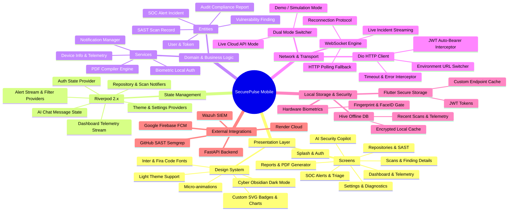
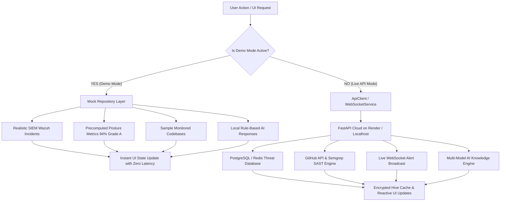
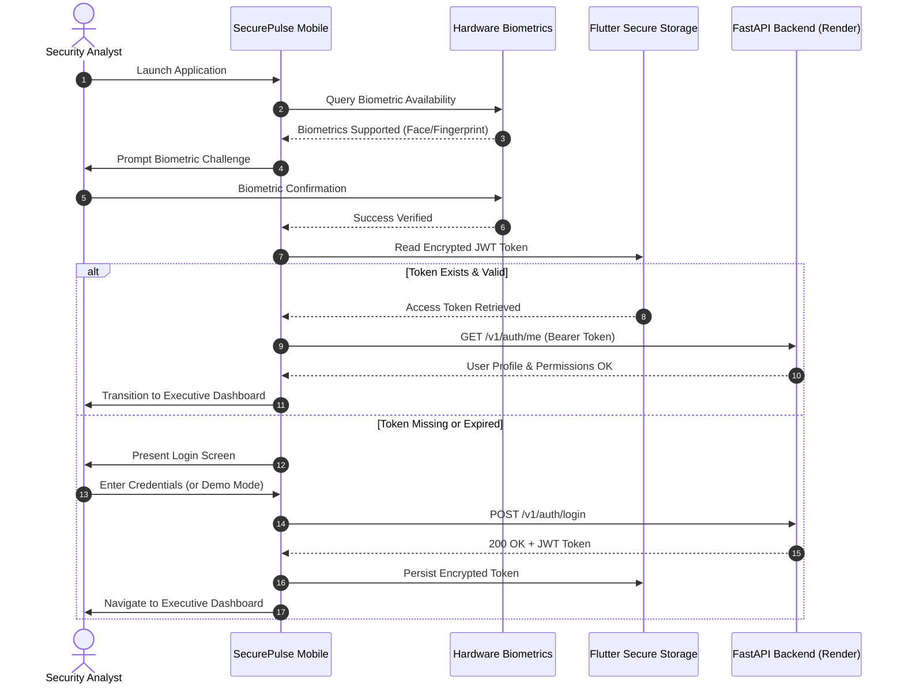
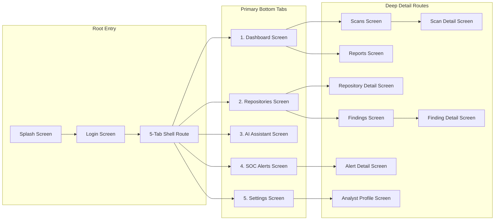

# SecurePulse Mobile — Architecture & System Mindmap 🧠

This document visualizes the entire system architecture, component relationships, data flow pipelines, state tree, and security models of **SecurePulse Mobile**.

---

## 🗺️ Master Architecture Mindmap

---

## 🔄 Dual Operating Mode Data Flow

---

## 🛡️ Security & Authentication Pipeline

---

## 📱 Navigation Graph & Screen Hierarchy

