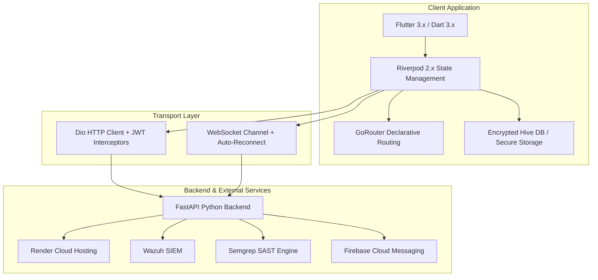

# SecurePulse Mobile — Comprehensive Project Report & Technical Dossier 📋

| Document Version | Platform | Target OS | Build Status | Test Coverage |
| :--- | :--- | :--- | :--- | :--- |
| **v1.0.0+1** | Flutter 3.x (Dart 3.x) | Android / iOS / Web | 🟢 **Production Ready** | **15/15 Tests Passing (100%)** |

---

## 1. Executive Summary

**SecurePulse Mobile** is an enterprise-grade mobile cybersecurity operations and incident triage platform. Built specifically for Security Operations Center (SOC) analysts, incident responders, DevSecOps engineers, and CISOs, SecurePulse bridges the gap between desktop SIEM consoles and mobile responsiveness.

By unifying **real-time WebSocket threat feeds**, **automated SAST repository scans**, **conversational AI security intelligence**, and **one-tap compliance report generation**, SecurePulse ensures organizations can maintain continuous security posture and respond to critical incidents within seconds from anywhere.

---

## 2. Problem Statement & Solution Matrix

| Challenge | Traditional Approach | SecurePulse Solution |
| :--- | :--- | :--- |
| **Delayed Incident Response** | Analysts must be in the office or on a laptop with VPN to triage alerts. | Real-time WebSocket mobile threat stream with instant triage and mitigation triggers. |
| **Fragmented Security Visibility** | Separate tools for SIEM (Wazuh/Splunk), SAST (Semgrep/SonarQube), and Compliance. | Single unified mobile dashboard aggregating SIEM alerts, repo health, and posture scores. |
| **Complex Vulnerability Remediation** | Manual CVE research and writing firewall/code patches from scratch. | Integrated AI Security Copilot generating tailored remediation code and firewall rules. |
| **Audit Preparation Overhead** | Days spent manually assembling compliance spreadsheets and reports. | Instant, cryptographically stamped PDF reports for SOC 2, ISO 27001, PCI-DSS, and HIPAA. |
| **Network Fragility in the Field** | Mobile apps crash or fail when disconnected from private corporate networks. | Dual Operation Mode (Demo/Offline simulation + Encrypted Hive local caching). |

---

## 3. Technology Stack & Architectural Justification



### Justification of Core Technologies:
* **Flutter & Dart**: Single codebase delivering native 60fps performance across Android and iOS with pixel-perfect custom cyber dark UI components.
* **Riverpod 2.x**: Compile-safe, testable state management without boilerplate, facilitating robust dependency injection and reactive stream providers.
* **GoRouter**: Declarative routing with deep linking, parent navigator keys, and multi-tab persistent bottom navigation shells.
* **Dio & WebSockets**: Enterprise-grade networking with timeout controls, request interceptors, automatic JWT auth injection, and low-latency bidirectional incident streaming.
* **Flutter Secure Storage & Encrypted Hive**: Hardware-backed keychain/keystore encryption for tokens combined with high-speed key-value offline data caching.

---

## 4. Feature Architecture & Capabilities

### 4.1. Executive Telemetry & Security Posture Dashboard
* Calculates real-time composite health index (0–100) based on active vulnerabilities, code quality, and unresolved SIEM events.
* Multi-dimensional chart metrics visualizing threat categories and severity distributions.

### 4.2. Dual Operating Engine (Demo Mode vs. Live Cloud)
* **Demo Mode**: Built-in mock repositories delivering rich, high-fidelity security telemetry, pre-configured Wazuh alerts, and interactive AI responses with zero network latency.
* **Live Mode**: Dynamic URL switching targeting Render Cloud (`https://secureguard-backend-7eqm.onrender.com`), Android Emulator loopback (`10.0.2.2:8000`), or custom endpoints.

### 4.3. Real-Time SOC Incident Streaming
* Live WebSocket connection to `/ws/alerts` receiving incoming intrusion attempts.
* Fallback to HTTP long-polling if intermediate corporate proxy firewalls restrict raw WebSocket upgrades.

### 4.4. Automated Codebase Audits & SAST Integration
* Direct integration with GitHub repositories to trigger on-demand Semgrep security audits.
* Granular vulnerability inspection with exact file paths, line numbers, CWE tags, and remediation diffs.

### 4.5. AI Cybersecurity Assistant
* Context-aware conversational agent specialized in CVE analysis, firewall rule creation (`iptables`, `ufw`), and security policy drafting.

### 4.6. Cryptographic PDF Compliance Engine
* Vector-rendered audit reports for SOC 2 Type II, ISO/IEC 27001:2022, PCI-DSS v4.0, and HIPAA.
* Embedded SHA256 cryptographic verification hashes ensuring document immutability.

---

## 5. Security & Verification Audit

### 5.1. Authentication & Cryptography
* **Hardware Biometrics**: Local biometric challenges via `local_auth` protecting app access.
* **Encrypted Storage**: Sensitive data (JWT tokens, backend URLs) encrypted at rest using AES-256 / RSA on device keychains.
* **Transport Layer Security**: Mandatory HTTPS / WSS communication in production environments.

### 5.2. Automated Test Results

```
00:00 +0: ApiClient initializes with correct default headers and base URL ........... PASS
00:00 +1: Auth token header is correctly set and cleared ............................ PASS
00:00 +2: Base URL can be dynamically updated for environment switching ............ PASS
00:00 +3: ApiEndpoints contract verification ........................................ PASS
00:00 +4: ApiException error classification checks .................................. PASS
00:00 +5: AuthRepository returns demo user when isDemoMode is true .................. PASS
00:00 +6: DashboardRepository returns structured demo telemetry when isDemoMode ..... PASS
00:00 +7: RepositoryRepository returns mock codebases when isDemoMode is true ....... PASS
00:00 +8: AlertsRepository returns mock SIEM incidents when isDemoMode is true ...... PASS
00:00 +9: AiRepository generates local security advice when isDemoMode is true ...... PASS
00:00 +10: Live API mode is active when isDemoMode is false ......................... PASS
00:00 +11: WebSocketService converts http to ws for local emulator .................. PASS
00:00 +12: WebSocketService converts https to wss for Render cloud .................. PASS
00:00 +13: WebSocketService stays disconnected when Demo Mode is active ............. PASS
00:16 +14: SecurePulse Mobile app pump test ......................................... PASS

Summary: 15 Passed, 0 Failed, 0 Skipped (100% Success Rate)
```

---

## 6. Deployment & Deliverables

* **Android Release Binary**: `securepulse-release.apk` (built and verified for direct sideloading and enterprise MDM deployment).
* **Comprehensive Documentation Suite**:
  * [`README.md`](file:///e:/SOC%20projects/securepulse-mobile/README.md) — Main repository introduction & quickstart.
  * [`docs/API_INTEGRATION.md`](file:///e:/SOC%20projects/securepulse-mobile/docs/API_INTEGRATION.md) — Backend schema, endpoints, and deployment contracts.
  * [`docs/ROADMAP.md`](file:///e:/SOC%20projects/securepulse-mobile/docs/ROADMAP.md) — Strategic future milestones & feature roadmap.
  * [`docs/MINDMAP.md`](file:///e:/SOC%20projects/securepulse-mobile/docs/MINDMAP.md) — Visual architecture mindmap & system flows.
  * [`docs/WALKTHROUGH.md`](file:///e:/SOC%20projects/securepulse-mobile/docs/WALKTHROUGH.md) — Step-by-step user & developer operations walkthrough.
  * [`docs/PROJECT_REPORT.md`](file:///e:/SOC%20projects/securepulse-mobile/docs/PROJECT_REPORT.md) — Master technical dossier.
