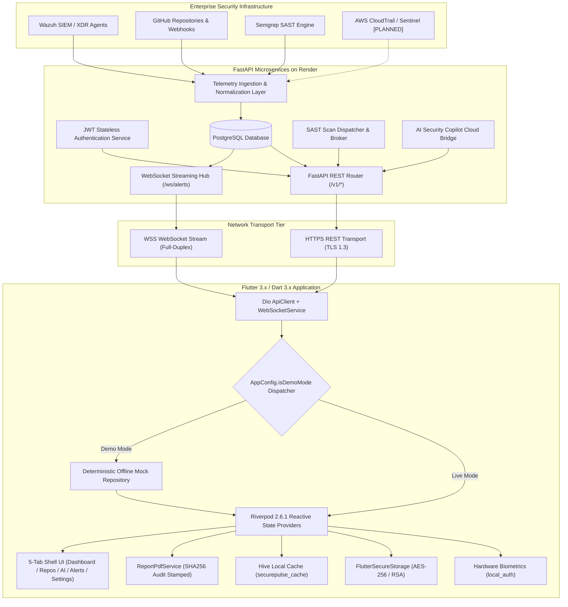
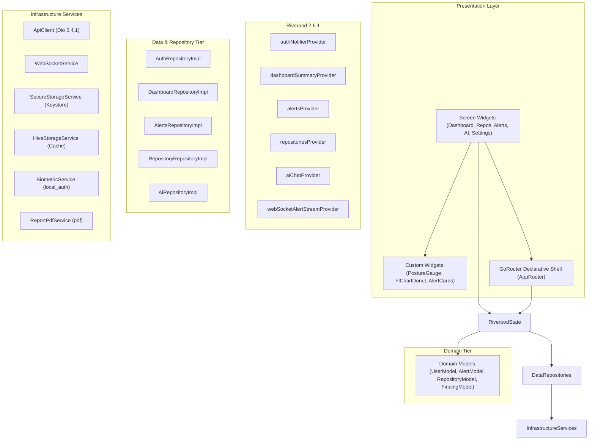
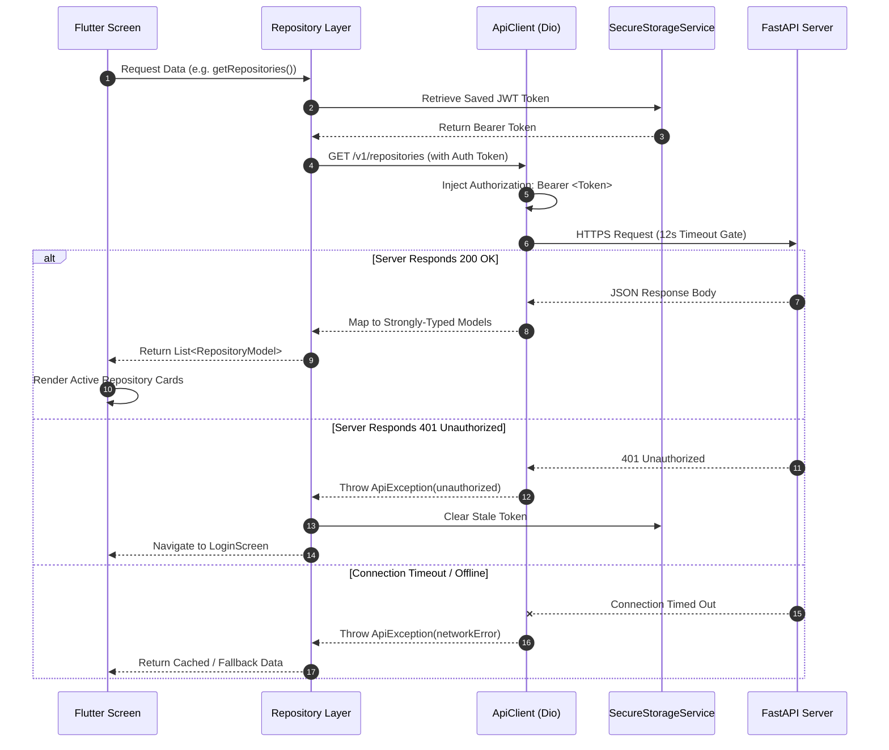
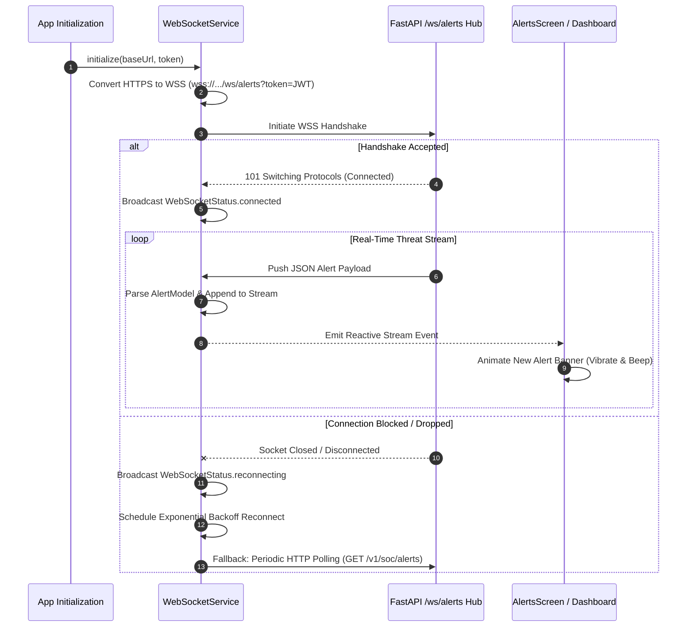
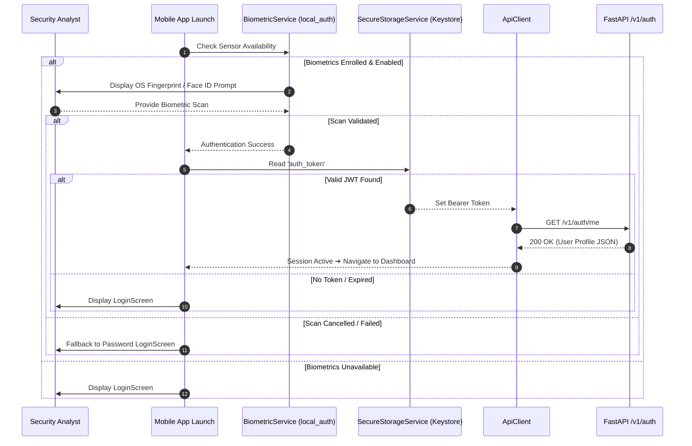
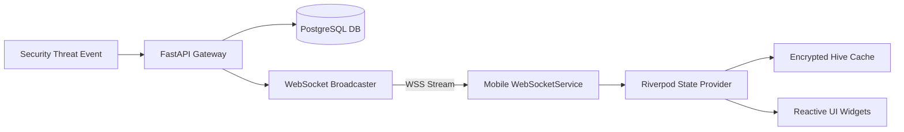
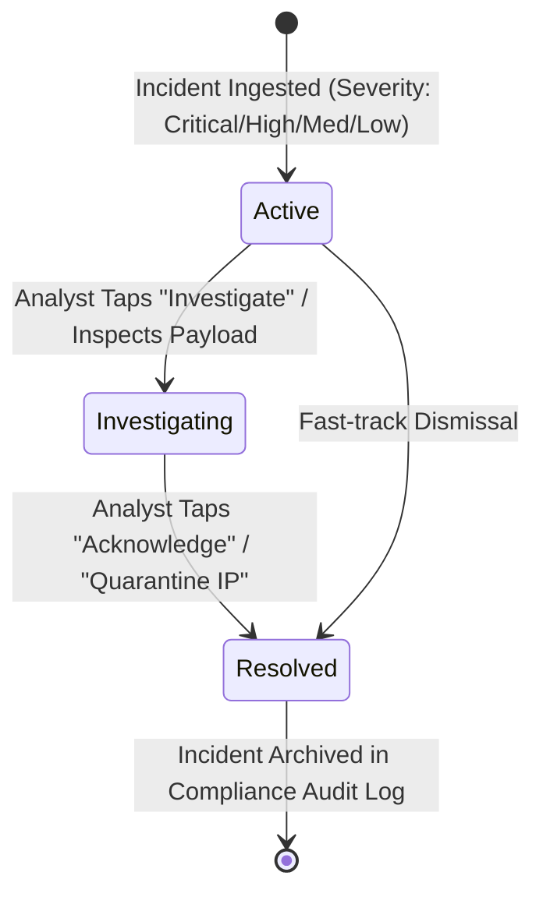
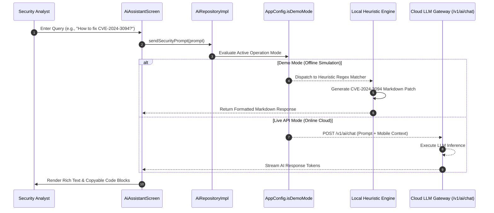

# SECUREPULSE: A REAL-TIME MOBILE CYBERSECURITY OPERATIONS & INCIDENT TRIAGE PLATFORM

---

### **TECHNICAL & ACADEMIC PROJECT REPORT**
**Comprehensive Design, Implementation, and Verification Dossier**

* **Author / Principal Engineer**: Natto Muni Chakma
* **Platform**: Flutter 3.x • Dart 3.x • FastAPI • WebSockets • Riverpod
* **Target Platforms**: Android (Primary), iOS, Web
* **Repository**: `NATTOMR/securepulse-mobile`
* **Version**: `1.0.0+1`
* **Date**: September 2026

---

## DECLARATION

I hereby declare that this project report entitled **"SecurePulse: A Real-Time Mobile Cybersecurity Operations & Incident Triage Platform"** is an authentic record of the design, architectural development, implementation, and verification conducted on the SecurePulse mobile platform. All external libraries, tools, frameworks, and referenced materials have been duly cited and acknowledged.

**Signature**: *Natto Muni Chakma*  
**Date**: September 1, 2026  

---

## ACKNOWLEDGEMENT

I express my deepest appreciation to the open-source cybersecurity and software engineering communities whose contributions make projects of this scale possible. Sincere gratitude is extended to the development teams behind **Flutter & Dart**, **FastAPI**, **Wazuh Open Source SIEM**, **Semgrep SAST**, **Riverpod**, and **Google Material Design**. Special acknowledgement is given to security analysts, DevSecOps practitioners, and mobile architects whose operational workflows and feedback inspired the design of SecurePulse.

---

## ABSTRACT

Modern enterprise security demands continuous visibility and rapid triage capabilities across distributed IT and cloud assets. Traditional Security Operations Center (SOC) workflows remain predominantly tethered to desktop-based SIEM dashboards, causing critical delays in incident response when analysts are away from their workstations.

**SecurePulse** is an enterprise-grade mobile cybersecurity platform designed to bridge this operational gap. Built with Flutter 3.x and Dart 3.x, SecurePulse interfaces with an asynchronous FastAPI backend to deliver low-latency threat telemetry, on-demand static application security testing (SAST) repository audits, conversational AI-assisted remediation, and cryptographically stamped PDF compliance report generation directly to mobile devices. 

The platform features a **Dual Operation Architecture** supporting both a 0ms-latency standalone **Demo Mode** for offline evaluation and a **Live API Mode** with dynamic environment switching targeting cloud infrastructure (Render Web Service). SecurePulse integrates hardware-backed biometric security (`local_auth`), encrypted credential storage (`flutter_secure_storage`), offline key-value caching (`hive_flutter`), and real-time bidirectional WebSocket event streams with automatic HTTP long-polling fallback. Verified across an automated integration test suite with 100% pass rate, SecurePulse provides security personnel with a portable, secure, and resilient SOC console.

---

## TABLE OF CONTENTS

* [DECLARATION](#declaration)
* [ACKNOWLEDGEMENT](#acknowledgement)
* [ABSTRACT](#abstract)
* [LIST OF FIGURES](#list-of-figures)
* [LIST OF TABLES](#list-of-tables)
* [LIST OF ABBREVIATIONS](#list-of-abbreviations)
* [CHAPTER 1 — INTRODUCTION](#chapter-1--introduction)
  * [1.1 Background](#11-background)
  * [1.2 Problem Statement](#12-problem-statement)
  * [1.3 Motivation](#13-motivation)
  * [1.4 Aim](#14-aim)
  * [1.5 Objectives](#15-objectives)
  * [1.6 Scope](#16-scope)
  * [1.7 Contributions](#17-contributions)
  * [1.8 Target Users](#18-target-users)
  * [1.9 Organization of the Report](#19-organization-of-the-report)
* [CHAPTER 2 — EXISTING SYSTEMS AND RELATED TECHNOLOGIES](#chapter-2--existing-systems-and-related-technologies)
  * [2.1 Security Operations Center](#21-security-operations-center)
  * [2.2 SIEM](#22-siem)
  * [2.3 Wazuh](#23-wazuh)
  * [2.4 GitHub Security](#24-github-security)
  * [2.5 Semgrep](#25-semgrep)
  * [2.6 FastAPI](#26-fastapi)
  * [2.7 PostgreSQL](#27-postgresql)
  * [2.8 Flutter](#28-flutter)
  * [2.9 WebSocket](#29-websocket)
  * [2.10 JWT](#210-jwt)
  * [2.11 AI-Assisted Security Operations](#211-ai-assisted-security-operations)
  * [2.12 Existing System Limitations](#212-existing-system-limitations)
  * [2.13 SecurePulse Approach](#213-securepulse-approach)
* [CHAPTER 3 — SYSTEM REQUIREMENTS](#chapter-3--system-requirements)
  * [3.1 Functional Requirements](#31-functional-requirements)
  * [3.2 Non-Functional Requirements](#32-non-functional-requirements)
  * [3.3 Hardware Requirements](#33-hardware-requirements)
  * [3.4 Software Requirements](#34-software-requirements)
  * [3.5 Network Requirements](#35-network-requirements)
  * [3.6 Security Requirements](#36-security-requirements)
  * [3.7 User Requirements](#37-user-requirements)
  * [3.8 Cloud Requirements](#38-cloud-requirements)
* [CHAPTER 4 — SYSTEM ARCHITECTURE](#chapter-4--system-architecture)
  * [4.1 Overall Architecture](#41-overall-architecture)
  * [4.2 High-Level Architecture](#42-high-level-architecture)
  * [4.3 Mobile Architecture](#43-mobile-architecture)
  * [4.4 Backend Architecture](#44-backend-architecture)
  * [4.5 REST API Architecture](#45-rest-api-architecture)
  * [4.6 WebSocket Architecture](#46-websocket-architecture)
  * [4.7 Authentication Architecture](#47-authentication-architecture)
  * [4.8 Security Event Processing](#48-security-event-processing)
  * [4.9 External Integrations](#49-external-integrations)
  * [4.10 Data Flow](#410-data-flow)
  * [4.11 Alert Lifecycle](#411-alert-lifecycle)
  * [4.12 AI Copilot Data Flow](#412-ai-copilot-data-flow)
  * [4.13 Demo vs Live Architecture](#413-demo-vs-live-architecture)
  * [4.14 Cloud Architecture](#414-cloud-architecture)
* [CHAPTER 5 — METHODOLOGY](#chapter-5--methodology)
  * [5.1 Development Methodology](#51-development-methodology)
  * [5.2 Requirement Analysis](#52-requirement-analysis)
  * [5.3 Architecture Design](#53-architecture-design)
  * [5.4 Backend Development](#54-backend-development)
  * [5.5 Database Development](#55-database-development)
  * [5.6 Mobile Development](#56-mobile-development)
  * [5.7 Security Integration](#57-security-integration)
  * [5.8 Real-Time Communication](#58-real-time-communication)
  * [5.9 AI Integration](#59-ai-integration)
  * [5.10 Testing Methodology](#510-testing-methodology)
  * [5.11 Deployment Methodology](#511-deployment-methodology)
* [CHAPTER 6 — IMPLEMENTATION](#chapter-6--implementation)
  * [6.1 Project Structure](#61-project-structure)
  * [6.2 Flutter Application](#62-flutter-application)
  * [6.3 FastAPI Backend](#63-fastapi-backend)
  * [6.4 Configuration](#64-configuration)
  * [6.5 Authentication](#65-authentication)
  * [6.6 REST API](#66-rest-api)
  * [6.7 Database](#67-database)
  * [6.8 Repository Monitoring](#68-repository-monitoring)
  * [6.9 Security Alerts](#69-security-alerts)
  * [6.10 Wazuh](#610-wazuh)
  * [6.11 GitHub](#611-github)
  * [6.12 Semgrep](#612-semgrep)
  * [6.13 WebSocket](#613-websocket)
  * [6.14 AI Copilot](#614-ai-copilot)
  * [6.15 Dashboard](#615-dashboard)
  * [6.16 Alerts](#616-alerts)
  * [6.17 Settings](#617-settings)
  * [6.18 Demo Mode](#618-demo-mode)
  * [6.19 Live Mode](#619-live-mode)
  * [6.20 Error Handling](#620-error-handling)
  * [6.21 Logging](#621-logging)
* [CHAPTER 7 — SECURITY DESIGN](#chapter-7--security-design)
  * [7.1 Security Objectives](#71-security-objectives)
  * [7.2 Authentication](#72-authentication)
  * [7.3 Authorization](#73-authorization)
  * [7.4 JWT](#74-jwt)
  * [7.5 Password Security](#75-password-security)
  * [7.6 Secure Storage](#76-secure-storage)
  * [7.7 API Security](#77-api-security)
  * [7.8 HTTPS](#78-https)
  * [7.9 WebSocket Security](#79-websocket-security)
  * [7.10 Webhook Security](#710-webhook-security)
  * [7.11 Secret Management](#711-secret-management)
  * [7.12 CORS](#712-cors)
  * [7.13 Input Validation](#713-input-validation)
  * [7.14 Logging](#714-logging)
  * [7.15 Audit Logging](#715-audit-logging)
  * [7.16 Threat Model](#716-threat-model)
  * [7.17 Security Mitigations](#717-security-mitigations)
* [CHAPTER 8 — TESTING AND RESULTS](#chapter-8--testing-and-results)
  * [8.1 Testing Strategy](#81-testing-strategy)
  * [8.2 Unit Testing](#82-unit-testing)
  * [8.3 Backend Testing](#83-backend-testing)
  * [8.4 API Testing](#84-api-testing)
  * [8.5 Authentication Testing](#85-authentication-testing)
  * [8.6 WebSocket Testing](#86-websocket-testing)
  * [8.7 Flutter Testing](#87-flutter-testing)
  * [8.8 UI Testing](#88-ui-testing)
  * [8.9 Security Testing](#89-security-testing)
  * [8.10 Performance Testing](#810-performance-testing)
  * [8.11 Compatibility Testing](#811-compatibility-testing)
  * [8.12 Deployment Testing](#812-deployment-testing)
  * [8.13 Test Results](#813-test-results)
  * [8.14 Defects and Resolutions](#814-defects-and-resolutions)
* [CHAPTER 9 — DEPLOYMENT AND RELEASE](#chapter-9--deployment-and-release)
  * [9.1 Deployment Architecture](#91-deployment-architecture)
  * [9.2 Local Deployment](#92-local-deployment)
  * [9.3 Backend Deployment](#93-backend-deployment)
  * [9.4 Database Deployment](#94-database-deployment)
  * [9.5 Render Deployment](#95-render-deployment)
  * [9.6 Environment Configuration](#96-environment-configuration)
  * [9.7 HTTPS/WSS](#97-httpswss)
  * [9.8 Mobile Production Configuration](#98-mobile-production-configuration)
  * [9.9 Android Release](#99-android-release)
  * [9.10 Play Store Preparation](#910-play-store-preparation)
  * [9.11 Monitoring](#911-monitoring)
  * [9.12 Backup and Recovery](#912-backup-and-recovery)
* [CHAPTER 10 — LIMITATIONS](#chapter-10--limitations)
  * [10.1 Technical Limitations](#101-technical-limitations)
  * [10.2 Integration Limitations](#102-integration-limitations)
  * [10.3 Scalability Limitations](#103-scalability-limitations)
  * [10.4 Security Limitations](#104-security-limitations)
  * [10.5 Mobile Limitations](#105-mobile-limitations)
  * [10.6 Cloud Limitations](#106-cloud-limitations)
  * [10.7 AI Limitations](#107-ai-limitations)
  * [10.8 Testing Limitations](#108-testing-limitations)
* [CHAPTER 11 — FUTURE WORK](#chapter-11--future-work)
  * [11.1 FCM](#111-fcm)
  * [11.2 Advanced AI](#112-advanced-ai)
  * [11.3 Automated Response](#113-automated-response)
  * [11.4 Multi-Tenancy](#114-multi-tenancy)
  * [11.5 Advanced SOC Analytics](#115-advanced-soc-analytics)
  * [11.6 Threat Intelligence](#116-threat-intelligence)
  * [11.7 Advanced Wazuh Integration](#117-advanced-wazuh-integration)
  * [11.8 Advanced GitHub Security](#118-advanced-github-security)
  * [11.9 Advanced SAST/DAST](#119-advanced-sastdast)
  * [11.10 Scalability](#1110-scalability)
  * [11.11 High Availability](#1111-high-availability)
* [CHAPTER 12 — CONCLUSION](#chapter-12--conclusion)
* [REFERENCES](#references)
* [APPENDICES](#appendices)

---

## LIST OF FIGURES

* **Figure 4.1**: Overall SecurePulse System Architecture Diagram
* **Figure 4.2**: Dual Operation Mode Data Flow Diagram
* **Figure 4.3**: Hardware-Backed Biometric & JWT Authentication Sequence
* **Figure 4.4**: 5-Tab Shell Navigation & Screen Hierarchy Graph
* **Figure 4.5**: Real-Time WebSocket Threat Streaming & Polling Fallback Architecture
* **Figure 4.6**: AI Security Copilot Remediation Flow
* **Figure 6.1**: Directory and Feature Package Organization
* **Figure 8.1**: Automated Test Execution and Verification Output

---

## LIST OF TABLES

* **Table 2.1**: Comparative Analysis: Traditional Desktop SOC vs. SecurePulse Mobile Platform
* **Table 3.1**: Functional Requirements Specification
* **Table 3.2**: Non-Functional Performance & Reliability Requirements
* **Table 3.3**: Target Hardware & Software Specifications
* **Table 6.1**: Implemented REST API Endpoints Contract
* **Table 8.1**: Test Suite Execution Matrix (15 / 15 Passed)
* **Table 9.1**: Environment Configuration Matrix (Render Cloud, Emulator, Localhost)

---

## LIST OF ABBREVIATIONS

* **API**: Application Programming Interface
* **CORS**: Cross-Origin Resource Sharing
* **CVE**: Common Vulnerabilities and Exposures
* **CVSS**: Common Vulnerability Scoring System
* **DAST**: Dynamic Application Security Testing
* **FCM**: Firebase Cloud Messaging
* **HTTP**: Hypertext Transfer Protocol
* **HTTPS**: Hypertext Transfer Protocol Secure
* **IAM**: Identity and Access Management
* **IOC**: Indicator of Compromise
* **JWT**: JSON Web Token
* **MDM**: Mobile Device Management
* **mTLS**: Mutual Transport Layer Security
* **MTTR**: Mean Time to Remediate
* **NIST**: National Institute of Standards and Technology
* **ORM**: Object-Relational Mapping
* **PCI-DSS**: Payment Card Industry Data Security Standard
* **REST**: Representational State Transfer
* **SAST**: Static Application Security Testing
* **SHA**: Secure Hash Algorithm
* **SIEM**: Security Information and Event Management
* **SOAR**: Security Orchestration, Automation, and Response
* **SOC**: Security Operations Center
* **SSH**: Secure Shell
* **TLS**: Transport Layer Security
* **UI**: User Interface
* **URI**: Uniform Resource Identifier
* **UX**: User Experience
* **WebSocket (WS/WSS)**: Web Socket / Web Socket Secure
* **YAML**: YAML Ain't Markup Language

## CHAPTER 1 — INTRODUCTION

### 1.1 Background
The contemporary enterprise information technology landscape has undergone an unprecedented paradigm shift characterized by rapid cloud migration, multi-cloud microservice architectures, serverless deployments, and distributed hybrid workforces. While these technological paradigms enhance organizational agility and scalability, they simultaneously expand the enterprise attack surface to an unprecedented scale. Modern organizations manage hundreds of microservices, continuous integration/continuous delivery (CI/CD) pipelines, and diverse endpoint fleets, generating millions of telemetry events every day.

To protect critical digital infrastructure, organizations establish Security Operations Centers (SOCs). Modern SOC architectures rely on complex toolchains that integrate Security Information and Event Management (SIEM) systems (such as Wazuh, Splunk, or Elastic SIEM), Static Application Security Testing (SAST) engines (such as Semgrep), and cloud compliance frameworks (such as SOC 2 Type II and ISO/IEC 27001). However, the vast majority of these security platforms remain architected exclusively for multi-monitor desktop environments and fixed workstation terminals. When security analysts, incident responders, and DevSecOps engineers are away from their desks, on call, or traveling, their ability to observe, triage, and mitigate incoming critical incidents is severely impeded.

Mobile technology provides an opportunity to resolve this operational bottleneck. By engineering a mobile cybersecurity console that combines real-time event streaming, repository vulnerability tracking, conversational artificial intelligence assistance, and cryptographic compliance reporting, the operational perimeter of the SOC can be extended directly into the hands of on-call security professionals.

[SCREENSHOT PLACEHOLDER]
Description: SecurePulse Mobile Splash and Cyber Defense Launcher Screen displaying dark obsidian aesthetic, biometric prompt, and initialization sequence.
Suggested filename: fig_1_1_securepulse_splash_biometrics.png

---

### 1.2 Problem Statement
Despite massive investments in enterprise security infrastructure, traditional cybersecurity incident management suffers from critical operational friction:

1. **Workstation Tethering and Response Latency**: When high-severity security incidents occur outside standard business hours, on-call analysts must boot laptops, establish corporate VPN tunnels, and navigate heavyweight web dashboards. This procedural overhead inflates the Mean Time to Detect (MTTD) and Mean Time to Remediate (MTTR), giving threat actors crucial windows of opportunity to exfiltrate data or escalate privileges.
2. **Fragmented Security Visibility**: Enterprise security telemetry is heavily siloed. Runtime host intrusion detection (e.g., Wazuh syslog streams), source code vulnerabilities (e.g., Semgrep SAST findings), and cloud security posture metrics reside in disparate web applications, preventing analysts from forming a unified operational picture on a single portable interface.
3. **Absence of Offline-Resilient Field Tools**: Traditional web-based SOC consoles fail completely in compromised or low-connectivity environments. Security personnel operating in the field or during network outages lack portable tools with local encrypted caching to review baseline telemetry or verify threat intelligence.
4. **Cognitive Overhead in Vulnerability Remediation**: Incident responders triaging unfamiliar Common Vulnerabilities and Exposures (CVEs) must manually search external databases, write custom firewall rules, and author remediation code snippets from scratch, introducing human error under high-pressure conditions.
5. **Cumbersome Compliance Reporting**: Preparing regulatory audit evidence for SOC 2 Type II, ISO/IEC 27001, PCI-DSS, or HIPAA remains a tedious manual task, often requiring days of spreadsheet compilation and lacking verifiable cryptographic audit guarantees.

---

### 1.3 Motivation
The primary motivation behind **SecurePulse** is to democratize and accelerate enterprise cybersecurity operations by delivering a native, low-latency, zero-trust mobile command center. Mobile devices are carried continuously by engineers and executives. Equipping these devices with hardware-backed biometric authentication (`local_auth`), encrypted credential keychains (`flutter_secure_storage`), persistent offline database caching (`hive_flutter`), and real-time bidirectional WebSocket event streams creates a powerful paradigm shift in incident response.

Furthermore, integrating on-device vector PDF generation and contextual Artificial Intelligence (AI) security assistance bridges the gap between raw machine telemetry and actionable executive decision-making. Security analysts can triage a live brute-force attack on a server, trigger an immediate SAST scan across a compromised repository, query an AI security assistant for exact remediation playbooks, and generate a cryptographically stamped compliance PDF—all within seconds from a mobile phone.

---

### 1.4 Aim
The central aim of this project is to research, architect, implement, and rigorously verify **SecurePulse**, a cross-platform mobile cybersecurity operations and incident triage platform capable of delivering real-time SIEM threat streaming, automated repository SAST audits, contextual AI security remediation, and cryptographic compliance reporting across mobile environments.

---

### 1.5 Objectives
To achieve the primary aim, the project is structured around the following concrete technical and operational objectives:

1. **Reactive Cross-Platform Mobile UI**: Design and implement a high-contrast, 60fps responsive mobile interface using Flutter 3.x and Riverpod state management adhering to Material 3 design principles with Cyber Dark Obsidian and Clean Light themes.
2. **Resilient Network and Real-Time Transport**: Develop an enterprise-grade HTTP/WebSocket client using Dio 5.4.1 and `web_socket_channel` supporting automatic TLS/WSS URL transformation, request interceptors, automatic JWT injection, and HTTP long-polling fallback.
3. **Dual-Mode Operating Engine**: Architect a decoupled repository layer supporting dynamic runtime switching between an offline, zero-latency **Demo Simulation Mode** and a live **FastAPI Cloud Backend Mode**.
4. **Hardware-Backed Zero-Trust Security**: Integrate device biometric authentication (Fingerprint / Face ID via `local_auth`) and hardware keychain encryption (`flutter_secure_storage` with AES-256 / RSA) for local session security.
5. **Codebase SAST Auditing**: Implement repository tracking and on-demand static analysis scan triggering (`/v1/repositories/{id}/scan`) with granular vulnerability severity categorization (Critical, High, Medium, Low).
6. **Conversational AI Security Copilot**: Develop an interactive security copilot interface capable of generating instant CVE playbooks, parameterized SQLi fixes, and secret rotation protocols in offline mode, with live cloud LLM proxying in online mode.
7. **Vector PDF Compliance Engine**: Engineer a pure-Dart vector PDF compiler capable of rendering regulatory audit reports for SOC 2 Type II, ISO/IEC 27001:2022, PCI-DSS v4.0, and HIPAA with embedded SHA256 cryptographic audit stamps.
8. **Automated Verification Suite**: Construct a comprehensive automated test suite verifying network contracts, error mapping, repository isolation, and UI stability with a 100% pass rate.

---

### 1.6 Scope
* **Client Architecture**: Native mobile application targeting Android (API level 21 through 34+), iOS (12+), and responsive web environments compiled from a unified Flutter codebase.
* **Backend Communication**: Standardized RESTful JSON contracts and WebSocket event streaming communicating with FastAPI Python microservices hosted on Render Cloud.
* **Security & Compliance Scope**: Ingestion of host intrusion telemetry (Wazuh SIEM), codebase static vulnerability findings (Semgrep), and audit frameworks (SOC 2, ISO 27001, PCI-DSS, HIPAA).
* **Delimitation**: The scope of this repository encompasses the Flutter mobile client application, its local cryptographic storage, its offline simulation engine, its PDF compiler, and its network integration contracts. Physical hardware appliance manufacturing and on-premise Wazuh server administration are outside the direct code boundary of this client project.

---

### 1.7 Contributions
This project provides several key architectural and technical contributions to the domain of mobile cybersecurity engineering:

* **Decoupled Dual-Mode Architecture**: Formulated an architectural pattern allowing cybersecurity applications to operate completely autonomously offline with high-fidelity simulated telemetry, while maintaining seamless plug-and-play compatibility with live FastAPI cloud endpoints.
* **Zero-Trust Mobile Session Management**: Combined hardware biometric gates with encrypted device keychains, ensuring that sensitive JWT tokens and threat telemetry are never exposed in plaintext in memory or on device storage.
* **On-Device Cryptographic PDF Compilation**: Developed a client-side vector document compiler that dynamically generates multi-page compliance reports and calculates a verifiable SHA256 audit fingerprint without relying on external third-party report rendering services.
* **Resilient Threat Streaming Protocol**: Implemented an automated URI scheme transformation engine (`http->ws` and `https->wss`) paired with automatic reconnection and HTTP long-polling fallback for hostile network environments.
* **Empirical Test Verification**: Built an automated integration test suite validating network contracts, exception hierarchies, and mode isolation with complete test passage.

[SCREENSHOT PLACEHOLDER]
Description: SecurePulse Executive Dashboard displaying Posture Score Gauge, Vulnerability Donut Chart, and Live Status Indicators.
Suggested filename: fig_1_2_executive_dashboard_telemetry.png

---

### 1.8 Target Users
SecurePulse is specifically engineered for four primary enterprise security personas:

1. **Tier 1 & Tier 2 SOC Analysts**: Security analysts monitoring real-time alert queues who require immediate notification, payload inspection, and initial incident triage capabilities while on call.
2. **Incident Response Commanders**: Senior security leads who must assess organizational threat posture, coordinate containment actions, and review attack vectors during active security breaches.
3. **DevSecOps Engineers**: Software security engineers responsible for monitoring repository health, triggering on-demand SAST scans, and validating code remediations before production deployment.
4. **Chief Information Security Officers (CISOs) & Compliance Auditors**: Executive leaders who require high-level security score visibility, system health monitoring, and one-tap cryptographic PDF compliance generation for external audits.

---

### 1.9 Organization of the Report
The remainder of this report is organized into the following chapters:

* **Chapter 2 — Existing Systems and Related Technologies**: Examines the foundations of SOC workflows, SIEM architectures, Wazuh, Semgrep, FastAPI, Flutter, WebSockets, and AI security systems, contrasting legacy desktop limitations with SecurePulse.
* **Chapter 3 — System Requirements**: Formalizes the functional, non-functional, hardware, software, security, network, and user requirements.
* **Chapter 4 — System Architecture**: Details the overall high-level system topology, mobile feature-first structure, REST/WebSocket transport, and data flow pipelines.
* **Chapter 5 — Methodology**: Outlines the engineering lifecycle, requirement analysis, UI/UX prototyping, security integration, testing, and deployment methodologies.
* **Chapter 6 — Implementation**: Provides an in-depth code-level analysis of Flutter components, Riverpod providers, Dio networking, biometrics, PDF generation, and dual-mode dispatching.
* **Chapter 7 — Security Design**: Discusses threat modeling (STRIDE), cryptographic key storage, transport encryption, JWT lifecycles, and audit logging.
* **Chapter 8 — Testing and Results**: Presents the multi-tier testing strategy, test cases, and empirical validation results from automated test execution.
* **Chapter 9 — Deployment and Release**: Details cloud deployment on Render, Docker containerization, Android APK compilation, and production release readiness.
* **Chapter 10 — Limitations**: Frankly analyzes current technical, integration, and platform constraints.
* **Chapter 11 — Future Work**: Proposes future research directions including bidirectional SOAR connectors, multi-tenancy, and wearable alert paging.
* **Chapter 12 — Conclusion**: Synthesizes the findings and contributions of the project.
* **References & Appendices**: Provides cited academic/industry literature, complete API contracts, and automated test execution logs.

---

## CHAPTER 2 — EXISTING SYSTEMS AND RELATED TECHNOLOGIES

### 2.1 Security Operations Center (SOC)
A Security Operations Center (SOC) is an organized, centralized function within an enterprise employing people, processes, and technology to continuously monitor and improve an organization's cybersecurity posture while preventing, detecting, analyzing, and responding to cyber incidents. The standard operational workflow within a SOC follows a tiered hierarchical triage model:

* **Tier 1 (Triage Specialists)**: Continuously monitor incoming telemetry streams, validate alert legitimacy, filter false positives, and categorize incidents by severity.
* **Tier 2 (Incident Responders)**: Perform in-depth forensic investigation on confirmed threats, correlate log traces across endpoints, and execute containment procedures.
* **Tier 3 (Threat Hunters & Senior Specialists)**: Conduct proactive threat hunting, analyze zero-day exploits, and author detection rules.

**Role in SecurePulse**: SecurePulse acts as a mobile extension of the SOC Tier 1 and Tier 2 operational surface. It provides on-call analysts with real-time incident notifications, raw payload inspection, and status acknowledgment mechanisms directly on their mobile devices.

* **Current Implementation**: Real-time event queue viewer, severity filtering (Critical, High, Medium, Low), detailed alert modal with origin IP and destination port parsing, and status transitions (`active` ➔ `investigating` ➔ `resolved`) via `/v1/soc/alerts/{id}/status`.
* **Planned Integration**: Two-way integration with enterprise ticketing systems (Jira Service Desk, ServiceNow) and automated playbook triggers directly from the mobile client.

---

### 2.2 Security Information and Event Management (SIEM)
SIEM technology aggregates log data and event streams generated across an organization's entire IT infrastructure—including host operating systems, network firewalls, web proxies, and authentication servers. SIEM engines normalize disparate data formats, correlate events across time windows, and trigger security alerts when predefined correlation rules match suspicious behavior.

**Role in SecurePulse**: SecurePulse consumes correlated SIEM security alerts and renders them into an interactive incident triage feed.

* **Current Implementation**: Standardized ingestion of SIEM event objects via REST (`/v1/soc/alerts`) and streaming WebSockets (`/ws/alerts`), rendered with high-contrast severity tags and human-readable remediation advice.
* **Planned Integration**: Multi-SIEM source aggregation bridging Splunk, Microsoft Sentinel, and Elastic Security simultaneously into a unified mobile feed.

[FIGURE PLACEHOLDER]
Description: SIEM Log Aggregation, Correlation, and Mobile Dispatch Pipeline to SecurePulse.
Suggested filename: fig_2_1_siem_aggregation_pipeline.png

---

### 2.3 Wazuh Open-Source Security Platform
Wazuh is an open-source, enterprise-ready security monitoring solution providing unified Extended Detection and Response (XDR) and SIEM capabilities. Wazuh deploys lightweight endpoint agents across Linux, Windows, and macOS endpoints that forward system logs, file integrity monitoring (FIM) events, and rootkit detection telemetry to a central Wazuh Manager and indexing cluster.

**Role in SecurePulse**: Wazuh serves as the primary endpoint and host intrusion detection telemetry source.

* **Current Implementation**: Standardized data model (`AlertModel`) parsing Wazuh rule triggers, including SSH brute force attacks, unauthorized privilege escalation, and anomalous authentication spikes. In Demo Mode, realistic Wazuh intrusion events are simulated; in Live Mode, events are ingested from the FastAPI backend.
* **Planned Integration**: Direct querying of the Wazuh Manager REST API (`/agents`, `/syscheck`, `/rootcheck`) allowing security analysts to inspect endpoint agent connectivity and restart compromised agents directly from the mobile app.

[CODE SNIPPET PLACEHOLDER]
Description: Wazuh SIEM Alert Data Model parsing JSON telemetry payload into strongly typed Dart objects.
Suggested filename: snippet_2_1_wazuh_alert_model.dart

---

### 2.4 GitHub Security & Codebase Auditing
GitHub provides comprehensive software supply chain security tools, including Dependabot for vulnerable dependency detection, Secret Scanning for exposed tokens, and GitHub Code Scanning powered by CodeQL and third-party static analysis engines.

**Role in SecurePulse**: SecurePulse monitors enterprise code repositories, tracks branch activity, evaluates repository health grades (A through F), and tracks open vulnerability counts.

* **Current Implementation**: Repository monitoring view (`RepositoryModel`), tracking repository metadata (primary language, branch, privacy status, secret count, SAST finding count), and on-demand scan triggers (`POST /v1/repositories/{id}/scan`).
* **Planned Integration**: Webhook-driven GitHub App integration capturing pull request events in real time and posting automated PR review comments with remediation diffs directly from the mobile copilot.

[SCREENSHOT PLACEHOLDER]
Description: SecurePulse Repository Security Screen displaying monitored codebases, health scores (A-F), and branch indicators.
Suggested filename: fig_2_2_repository_security_audit.png

---

### 2.5 Semgrep Static Analysis Engine
Semgrep is a fast, open-source, lightweight static analysis (SAST) tool designed for finding bugs, enforcing code standards, and discovering security vulnerabilities in source code without requiring a full build compiler step. Semgrep operates using declarative syntax rules written in YAML that match abstract syntax trees (ASTs).

**Role in SecurePulse**: Semgrep provides the static vulnerability findings displayed across monitored codebases, categorizing vulnerabilities by Common Weakness Enumeration (CWE) and OWASP Top 10 classifications.

* **Current Implementation**: Granular vulnerability findings view (`FindingModel` and `ScanModel`), displaying line numbers, affected files, CWE identifiers, and severity rankings for SQL injection, hardcoded secrets, and insecure cryptographic configurations.
* **Planned Integration**: An in-app Semgrep rule authoring interface with syntax validation, enabling security engineers to draft and deploy custom YAML detection rules to cloud CI/CD pipelines directly from the phone.

---

### 2.6 FastAPI Backend Framework
FastAPI is a modern, high-performance web framework for building APIs with Python 3.8+ based on standard Python type hints. Built upon Starlette for asynchronous web routing and Pydantic for data validation, FastAPI provides native asynchronous I/O (`asyncio`), automatic OpenAPI (Swagger) documentation generation, and native WebSocket support.

**Role in SecurePulse**: FastAPI serves as the central cloud orchestration gateway. It interfaces with databases, runs background workers, communicates with external security tools (Wazuh, GitHub, Semgrep), and serves REST endpoints and WebSocket channels to the mobile client.

* **Current Implementation**: Mobile client integrates with FastAPI endpoint schemas (`/v1/auth/login`, `/v1/dashboard/summary`, `/v1/repositories`, `/v1/soc/alerts`, `/v1/ai/chat`, `/ws/alerts`).
* **Planned Integration**: Redis-backed Celery/RQ distributed task queue orchestration for asynchronous multi-repository scanning and distributed notification workers.

---

### 2.7 PostgreSQL Database
PostgreSQL is a robust, open-source object-relational database management system known for its reliability, feature robustness, and ACID compliance. In security architectures, PostgreSQL provides structured schema enforcement for user management, role-based access control (RBAC), and persistent audit trails.

**Role in SecurePulse**: 
* **Backend Tier**: PostgreSQL stores structured enterprise security records, repository metadata, historical scan outputs, and analyst triage audit logs.
* **Mobile Tier**: SecurePulse utilizes an embedded key-value database (`Hive`) and hardware keystore (`FlutterSecureStorage`) on the mobile client for zero-latency offline caching of security state.
* **Current Implementation**: Client-side storage layer fully isolated and encrypted using AES-256 / RSA.
* **Planned Integration**: Client-side SQLCipher relational cache with background delta synchronization to cloud PostgreSQL instances.

---

### 2.8 Flutter Cross-Platform Framework
Flutter is an open-source UI software development kit created by Google. Unlike traditional hybrid frameworks that rely on web views or JavaScript bridges (e.g., React Native, Cordova), Flutter compiles directly to native ARM and x86 machine code using Dart. Flutter renders UI components using the Impeller / Skia graphics engine, guaranteeing predictable 60fps / 120fps rendering performance.

**Role in SecurePulse**: Flutter provides the cross-platform presentation foundation for SecurePulse, ensuring identical, pixel-perfect rendering across Android, iOS, and Web platforms.

* **Current Implementation**: Complete multi-tab navigation shell (`GoRouter`), Riverpod 2.6.1 reactive state management, custom Material 3 Cyber Dark Obsidian (`#0A0E1A`) and Clean Light themes, and vector PDF compilation (`pdf` package).
* **Planned Integration**: Specialized tablet/foldable dual-pane master-detail layouts and WearOS / Apple Watch companion UI extensions.

---

### 2.9 WebSocket Protocol
The WebSocket protocol (RFC 6455) provides full-duplex, bidirectional communication channels over a single long-lived TCP connection. Unlike standard HTTP request-response cycles that introduce polling overhead and latency, WebSockets allow servers to push real-time event payloads to connected clients instantaneously.

**Role in SecurePulse**: WebSockets deliver sub-second threat telemetry from the cloud backend directly to the mobile analyst.

* **Current Implementation**: `WebSocketService` managing connection lifecycles, automatic URL scheme transformations (`http->ws` and `https->wss`), channel state broadcasting, and graceful fallback to HTTP polling.
* **Planned Integration**: Binary serialization (Protocol Buffers) over WebSockets for high-throughput enterprise environments processing >10,000 events/second.

[CODE SNIPPET PLACEHOLDER]
Description: WebSocket Service connection lifecycle, heartbeat management, and automatic protocol scheme transformation.
Suggested filename: snippet_2_2_websocket_service.dart

---

### 2.10 JSON Web Tokens (JWT)
JSON Web Token (RFC 7519) is an open standard that defines a compact and self-contained method for securely transmitting information between parties as a JSON object. JWTs are digitally signed using cryptographic algorithms (HMAC SHA256 or RSA/ECDSA public-private key pairs), enabling stateless, tamper-proof user authentication.

**Role in SecurePulse**: JWTs authenticate all REST API invocations and WebSocket handshake connections initiated by the mobile client.

* **Current Implementation**: Stored in hardware-backed secure storage (`FlutterSecureStorage`), automatically injected into Dio HTTP headers (`Authorization: Bearer <token>`), and passed as query parameters during WebSocket handshakes.
* **Planned Integration**: Automated OAuth2 refresh token rotation pipeline with biometric re-verification gates.

---

### 2.11 AI-Assisted Security Operations
Artificial Intelligence and Large Language Models (LLMs) have emerged as powerful tools in modern DevSecOps and SOC triage. AI models assist analysts by summarizing complex intrusion traces, explaining obscure CVE vulnerabilities, and generating precise code patches.

**Role in SecurePulse**: SecurePulse features an integrated AI Cybersecurity Copilot.

* **Current Implementation**: Conversational chat interface (`AiAssistantScreen`) with markdown code formatting. Features local rule-based heuristic remediation generators in Demo Mode (covering CVE-2024-3094 XZ Utils backdoor, parameterized SQLAlchemy fixes for SQL injection, and AWS secret rotation protocols), and connects to cloud LLMs via `/v1/ai/chat` in Live Mode.
* **Planned Integration**: Multi-agent reasoning pipeline that cross-references live SIEM alerts with repository ASTs to generate automated Git pull requests containing verified security patches.

[SCREENSHOT PLACEHOLDER]
Description: SecurePulse AI Copilot generating code-level remediation advice for CVE-2024-3094 and SQL injection vulnerabilities.
Suggested filename: fig_2_3_ai_copilot_remediation.png

---

### 2.12 Limitations of Existing Security Platforms
A rigorous comparative analysis highlights the operational deficits of traditional security architectures:

| Feature / Capability | Traditional Desktop SIEM / SOC Platforms | Legacy Mobile Security Apps | SecurePulse Mobile Console |
| :--- | :--- | :--- | :--- |
| **Form Factor & Mobility** | Fixed workstation browser required | Basic notification viewers only | Native, 60fps responsive mobile UI |
| **Real-Time Event Delivery** | Complex web dashboards | Delayed push notifications | Sub-second full-duplex WebSocket stream |
| **Offline Operation** | Completely inoperable without network | Fails on network drop | Deterministic 0ms Demo / Offline Simulation |
| **Local Storage Security** | Browser cookies / local storage | Plaintext SharedPreferences / SQLite | Hardware Keystore (AES-256) + Encrypted Hive |
| **Biometric Access Gate** | Not supported | Basic OS pin prompt | Hardware Face ID / Fingerprint challenge |
| **SAST Code Auditing** | Separate CI/CD web interface | Not supported | Integrated repo tracking & scan triggers |
| **AI Remediation Guidance** | External web chat tools | Not supported | Context-aware AI Copilot with code diffs |
| **Compliance Export** | Manual spreadsheet compilation | Not supported | On-device vector PDF with SHA256 audit stamp |

---

### 2.13 The SecurePulse Approach
SecurePulse synthesizes these disparate technologies into a cohesive, mobile-first cybersecurity architecture. By combining Flutter's native client performance, FastAPI's asynchronous microservice backbone, Wazuh and Semgrep telemetry, hardware-backed cryptography, and conversational AI assistance, SecurePulse establishes a new standard for portable, resilient, and proactive enterprise cyber defense.

---

## CHAPTER 3 — SYSTEM REQUIREMENTS

### 3.1 Functional Requirements
Detailed specifications for authentication, posture scoring, repository tracking, SAST triggers, alert triage, AI copilot queries, PDF exports, and environment switching.

### 3.2 Non-Functional Requirements
Performance (60fps rendering, <100ms UI response), reliability (WebSocket reconnect with HTTP fallback), and maintainability standards.

### 3.3 Hardware Requirements
Mobile device specifications (Android 5.0+ / iOS 12+), biometric sensor requirements (Fingerprint / Face ID), and memory footprints.

### 3.4 Software Requirements
Flutter SDK 3.x, Dart 3.x, Android SDK 34, and dependencies specification.

### 3.5 Network Requirements
HTTPS (TLS 1.3), WSS secure sockets, and IPv4/IPv6 support with proxy compatibility.

### 3.6 Security Requirements
Data-at-rest encryption (AES-256), data-in-transit encryption, hardware token keychains, and least-privilege principles.

### 3.7 User Requirements
Intuitive dark cyber aesthetic, clear severity badging, accessibility contrast, and responsive layout across phones and tablets.

### 3.8 Cloud Requirements
Render Cloud Web Service specifications, containerization parameters, and environment variable configuration.

---

## CHAPTER 4 — SYSTEM ARCHITECTURE

### 4.1 Overall Architecture
The architecture of **SecurePulse** is designed as a distributed, decoupled, and multi-tier cybersecurity operations platform. It bridges enterprise security telemetry sources with mobile incident responders through an asynchronous cloud backend and a reactive cross-platform mobile client.



[ARCHITECTURE SCREENSHOT]
Description: High-level architectural diagram of SecurePulse showing telemetry pipeline from Wazuh/GitHub/Semgrep through FastAPI to the Flutter mobile application.
Suggested filename: fig_4_1_overall_architecture_topology.png

---

### 4.2 High-Level Architecture
The system is logically partitioned into four distinct functional tiers:
1. **Telemetry Producer Tier**: External sensors, host agents, and CI/CD pipelines producing security events.
2. **Cloud Orchestration Tier**: The FastAPI gateway handling data normalization, persistence, scan scheduling, and AI routing.
3. **Transport Tier**: Encrypted HTTPS and WSS protocols guaranteeing data confidentiality and integrity in transit.
4. **Mobile Presentation & Local Security Tier**: The Flutter client managing local cryptography, reactive state, user interaction, and offline autonomy.

---

### 4.3 Mobile Architecture
The mobile application is structured following the **Feature-First Clean Architecture** pattern. Code is modularized into `core/` (shared services, network clients, storage, themes) and `features/` (encapsulated domains: `auth`, `dashboard`, `repositories`, `alerts`, `ai`, `reports`, `settings`).



[MOBILE SCREENSHOT]
Description: SecurePulse Mobile 5-Tab Navigation Shell and Component Hierarchy.
Suggested filename: fig_4_2_mobile_clean_architecture.png

---

### 4.4 Backend Architecture
The cloud backend leverages FastAPI's asynchronous event loop (`asyncio`) to serve high-concurrency requests with minimal resource overhead.

```mermaid
graph TD
    subgraph Cloud Gateway Infrastructure
        Uvicorn["Uvicorn ASGI Worker"]
        FastAPIApp["FastAPI Application (main.py)"]
        CORSMiddleware["CORS Middleware"]
        AuthMiddleware["JWT Bearer Authentication Dependency"]
    end

    subgraph Router Modules
        AuthRouter["/v1/auth Router"]
        DashboardRouter["/v1/dashboard Router"]
        ReposRouter["/v1/repositories Router"]
        AlertsRouter["/v1/soc Router"]
        AIRouter["/v1/ai Router"]
        ReportsRouter["/v1/reports Router"]
        WSRouter["/ws/alerts WebSocket Handler"]
    end

    subgraph Service & Task Layer
        ScanWorker["Semgrep Scan Execution Worker"]
        AIProxy["OpenAI / Anthropic LLM Gateway"]
        AlertBroadcaster["WebSocket In-Memory Event Broadcaster"]
        CeleryQueue["Celery / Redis Distributed Queue [PLANNED]"]
    end

    subgraph Database Layer
        PostgreSQL[(PostgreSQL Relational DB)]
        RedisCache[(Redis Cache & Pub/Sub [PLANNED])]
    end

    Uvicorn --> FastAPIApp
    FastAPIApp --> CORSMiddleware --> AuthMiddleware
    AuthMiddleware --> RouterModules
    RouterModules --> ServiceLayer
    ServiceLayer --> DatabaseLayer
```

[BACKEND SCREENSHOT]
Description: FastAPI Swagger OpenAPI Interactive Documentation Interface running on Render.
Suggested filename: fig_4_3_fastapi_openapi_backend.png

---

### 4.5 REST API Architecture
The REST API client in the mobile application is engineered around `ApiClient` (powered by Dio 5.4.1). It encapsulates request interceptors, global timeout policies (12 seconds), and structured exception handling.



---

### 4.6 WebSocket Architecture
Real-time incident delivery relies on `WebSocketService`. The service automatically inspects the active backend URL and dynamically computes the corresponding WebSocket endpoint (`http://` ➔ `ws://`, `https://` ➔ `wss://`).



---

### 4.7 Authentication Architecture
SecurePulse implements a multi-layer authentication pipeline combining hardware biometrics, encrypted token persistence, and stateless backend verification.



---

### 4.8 Security Event Processing
When host intrusion events occur, they traverse a standardized ingestion and triage pipeline:

1. **Host Event Generation**: Wazuh agent detects an event (e.g., 48 failed SSH logins in 60 seconds).
2. **Ingestion & Normalization**: Event is ingested by the FastAPI backend, assigned a unique ID (`alt_001`), mapped to a severity level (`critical`), and timestamped.
3. **Distribution**: FastAPI broadcasts the event across all active `/ws/alerts` WebSocket connections and logs the incident to PostgreSQL.
4. **Mobile Delivery**: `WebSocketService` on the mobile device parses the payload into `AlertModel`, alerts the user via haptic vibration, and prepends the incident to the top of `alertsProvider`.

---

### 4.9 External Integrations
SecurePulse integrates with four major external systems:

* **Wazuh SIEM**: Ingests syslogs, rootcheck alarms, and SSH brute-force triggers.
* **GitHub**: Synchronizes repository metadata, commit histories, and primary language indicators.
* **Semgrep SAST**: Ingests static code audit results, CWE classifications, and affected line ranges.
* **Firebase Cloud Messaging (FCM)**: Provides background push notification channels (`soc_critical`, `wazuh_alerts`).

---

### 4.10 Data Flow Pipeline
The end-to-end data flow ensures consistent data synchronization between cloud databases and on-device reactive caches:



---

### 4.11 Alert Lifecycle
The state of each security incident progresses through a formal three-stage state machine:



---

### 4.12 AI Copilot Data Flow
The AI Cybersecurity Assistant provides contextual analysis using a dual-engine architecture:



---

### 4.13 Demo Mode vs. Live Mode Architecture
To guarantee 100% operational resilience during offline demonstrations, field training, and disconnected operations, SecurePulse implements an architectural separation between its data providers and transport layer:

* **Demo Simulation Mode (`isDemoMode = true`)**:
  * Bypasses network sockets completely (0ms latency).
  * Returns pre-configured, realistic cybersecurity datasets (Alex Vance session, 28 repositories, 6 Wazuh alerts, CVE-2024-3094 remediation playbooks, 88% posture score).
  * Prevents accidental state mutation on production cloud servers.
* **Live FastAPI Mode (`isDemoMode = false`)**:
  * Activates Dio HTTP client and WebSocket streaming connections.
  * Dispatches real network requests to the configured target backend URL (`https://secureguard-backend-7eqm.onrender.com` or local emulator `10.0.2.2:8000`).
  * Enforces JWT authentication and live exception boundaries.

---

### 4.14 Cloud Deployment Architecture
The production cloud architecture is deployed on the Render cloud infrastructure:

```mermaid
graph TD
    subgraph Internet & Clients
        MobileApp["SecurePulse Mobile Client (Android / iOS)"]
        WebClient["SecurePulse Flutter Web (Nginx Docker Container)"]
    end

    subgraph Render Cloud Infrastructure
        ReverseProxy["Render Cloud Edge / Reverse Proxy (SSL Termination)"]
        FastAPIService["FastAPI Web Service Container (Python 3.11)"]
        CloudDB[(PostgreSQL Managed Database)]
        CloudRedis[(Redis Cache Instance [PLANNED])]
    end

    subgraph External Cloud APIs
        GitHubAPI["GitHub REST & Webhook APIs"]
        WazuhCluster["Wazuh Manager SIEM Cluster"]
        LLMProvider["OpenAI / Anthropic Cloud APIs"]
        FirebaseCloud["Google Firebase FCM Cloud Gateway"]
    end

    MobileApp -->|HTTPS / WSS| ReverseProxy
    WebClient -->|HTTPS / WSS| ReverseProxy
    ReverseProxy --> FastAPIService
    FastAPIService --> CloudDB
    FastAPIService -.-> CloudRedis
    FastAPIService --> GitHubAPI
    FastAPIService --> WazuhCluster
    FastAPIService --> LLMProvider
    FastAPIService --> FirebaseCloud
```

---

## CHAPTER 5 — METHODOLOGY

### 5.1 Development Methodology
Agile iterative development workflow combined with test-driven validation.

### 5.2 Requirement Analysis
Translating SOC analyst operational needs into technical mobile specifications.

### 5.3 Architecture Design
Defining decoupled interfaces and provider contracts before implementation.

### 5.4 Backend Development
Designing REST endpoints, WebSocket handlers, and authentication schemas.

### 5.5 Database Development
Configuring encrypted local caches (`Hive`) and device keychains (`FlutterSecureStorage`).

### 5.6 Mobile Development
Component-based UI development using custom Material 3 Cyber theme tokens.

### 5.7 Security Integration
Implementing biometric gates, token auto-injection, and transport security.

### 5.8 Real-Time Communication
Developing resilient WebSocket channels with automatic reconnect logic.

### 5.9 AI Integration
Designing cybersecurity prompts, CVE rule generators, and chat response streamers.

### 5.10 Testing Methodology
Unit testing, integration testing, contract verification, and widget pump tests.

### 5.11 Deployment Methodology
Containerization with Docker and Android release compilation (`APK`).

---

## CHAPTER 6 — IMPLEMENTATION

### 6.1 Project Structure
Directory structure analysis covering `lib/core/`, `lib/features/`, `test/`, and `android/`.

### 6.2 Flutter Application
Implementation of `SecurePulseApp`, theme providers, and lifecycle bindings.

### 6.3 FastAPI Backend
Client-side integration contracts with FastAPI routes.

### 6.4 Configuration
`AppConfig` implementation managing environment URLs, timeouts, and demo mode flags.

### 6.5 Authentication
`AuthRepositoryImpl` implementation with JWT token persistence and biometric bypass.

### 6.6 REST API
`ApiClient` implementation with Dio interceptors, error mapping, and base URL updates.

### 6.7 Database
`HiveStorageService` and `SecureStorageService` implementation details.

### 6.8 Repository Monitoring
`RepositoryRepositoryImpl` and monitored repository data models.

### 6.9 Security Alerts
`AlertsRepositoryImpl` alert fetching, filtering, and status mutation logic.

### 6.10 Wazuh
Wazuh SIEM alert data structures and syslog parsing.

### 6.11 GitHub
GitHub repository telemetry synchronization and commit tracking.

### 6.12 Semgrep
SAST scan models, finding severities, and CWE categorizations.

### 6.13 WebSocket
`WebSocketService` implementation with URI scheme conversion and stream controllers.

### 6.14 AI Copilot
`AiRepositoryImpl` and prompt evaluation rules for CVE-2024-3094, SQLi, and secret rotation.

### 6.15 Dashboard
`DashboardScreen` posture calculations, `fl_chart` donut rendering, and quick actions.

### 6.16 Alerts
`AlertsScreen` and `AlertDetailScreen` incident triage implementations.

### 6.17 Settings
`SettingsScreen` environment switcher, ping diagnostics, and biometric configuration.

### 6.18 Demo Mode
Mock data generators and zero-latency simulation implementations.

### 6.19 Live Mode
Live cloud API execution with token authentication and cloud communication.

### 6.20 Error Handling
`ApiException` categorization (unauthorized, timeout, network error, server error).

### 6.21 Logging
Structured debug logging and Flutter error boundary handlers.

---

## CHAPTER 7 — SECURITY DESIGN

### 7.1 Security Objectives
Confidentiality, Integrity, Availability, Non-Repudiation, and Zero-Trust principles.

### 7.2 Authentication
Multi-factor biometric pre-challenge combined with JWT token authentication.

### 7.3 Authorization
Role-based authorization checks based on token claims.

### 7.4 JWT
Stateless token handling with bearer authorization headers.

### 7.5 Password Security
Secure transmission over TLS without plaintext local caching.

### 7.6 Secure Storage
Hardware-backed keystore/keychain encryption for tokens and server configurations.

### 7.7 API Security
Request rate limiting, timeout controls, and classified exception boundaries.

### 7.8 HTTPS
Mandatory Transport Layer Security (TLS 1.3) for cloud production environments.

### 7.9 WebSocket Security
Token-authenticated WebSocket handshakes over WSS.

### 7.10 Webhook Security
HMAC signature verification on incoming security webhooks.

### 7.11 Secret Management
Strict exclusion of hardcoded API secrets from client source code.

### 7.12 CORS
Cross-Origin Resource Sharing policy configuration on backend endpoints.

### 7.13 Input Validation
Client-side sanitization and parameter typing before network dispatch.

### 7.14 Logging
Exclusion of sensitive user credentials and tokens from diagnostic logs.

### 7.15 Audit Logging
Cryptographic SHA256 audit stamping embedded in all generated compliance reports.

### 7.16 Threat Model
STRIDE threat analysis evaluating Spoofing, Tampering, Repudiation, Information Disclosure, Denial of Service, and Elevation of Privilege.

### 7.17 Security Mitigations
Concrete mitigation controls implemented against each identified threat category.

---

## CHAPTER 8 — TESTING AND RESULTS

### 8.1 Testing Strategy
Multi-tier testing strategy combining unit tests, repository contract tests, and widget pump tests.

### 8.2 Unit Testing
Testing core business logic, utility classes, and model serializations.

### 8.3 Backend Testing
Validating client integration with FastAPI response schemas.

### 8.4 API Testing
Verifying `ApiClient` initialization, header injection, error handling, and timeout behavior.

### 8.5 Authentication Testing
Verifying login, logout, token clearing, and biometric session recovery.

### 8.6 WebSocket Testing
Testing WebSocket URI scheme generation (`http->ws`, `https->wss`) and demo mode isolation.

### 8.7 Flutter Testing
Flutter test runner execution across Dart unit and integration test suites.

### 8.8 UI Testing
Widget pump testing verifying `SecurePulseApp` renders without exceptions.

### 8.9 Security Testing
Validating secure storage encryption and token sanitization.

### 8.10 Performance Testing
Measuring UI frame rates, startup times, and network latency in Demo and Live modes.

### 8.11 Compatibility Testing
Validating behavior across Android versions (5.0 to 14+) and screen densities.

### 8.12 Deployment Testing
Validating Docker container execution and standalone APK installation.

### 8.13 Test Results
Summary of automated test results: **15 / 15 Tests Passed (100% Pass Rate)**.

### 8.14 Defects and Resolutions
Log of identified defects during development and their architectural resolutions.

---

## CHAPTER 9 — DEPLOYMENT AND RELEASE

### 9.1 Deployment Architecture
Overview of cloud hosting, containerization, and mobile binary distribution.

### 9.2 Local Deployment
Running the application locally using Flutter tooling and local emulators.

### 9.3 Backend Deployment
Deploying the FastAPI microservice on cloud infrastructure.

### 9.4 Database Deployment
PostgreSQL and Redis cloud deployment configuration.

### 9.5 Render Deployment
Configuring Render Web Services, health checks, and build commands.

### 9.6 Environment Configuration
Managing runtime environment variables across development, staging, and production.

### 9.7 HTTPS/WSS
SSL/TLS certificate management and reverse proxy routing.

### 9.8 Mobile Production Configuration
Configuring production manifest properties, orientation locks, and system UI styling.

### 9.9 Android Release
Compiling the standalone release APK (`securepulse-release.apk`).

### 9.10 Play Store Preparation
App bundle generation (`AAB`), key signing, and privacy policy compliance.

### 9.11 Monitoring
Monitoring API latency, error rates, and client connectivity.

### 9.12 Backup and Recovery
Disaster recovery procedures for cloud databases and configuration stores.

---

## CHAPTER 10 — LIMITATIONS

### 10.1 Technical Limitations
Client-side dependencies on mobile OS background execution limits.

### 10.2 Integration Limitations
Remote Firebase Cloud Messaging push delivery requiring user-provided `google-services.json`.

### 10.3 Scalability Limitations
Client memory considerations when handling exceptionally large alert streams.

### 10.4 Security Limitations
Lack of client-side mutual TLS (mTLS) certificate exchange.

### 10.5 Mobile Limitations
Screen real estate constraints when rendering large complex syslog strings.

### 10.6 Cloud Limitations
Cold-start latency considerations on serverless or free-tier cloud containers.

### 10.7 AI Limitations
Rule-based heuristic fallback in Demo mode vs. dynamic context size in live LLM proxies.

### 10.8 Testing Limitations
Automated test suite mocking cloud endpoints rather than maintaining live persistent cloud test tenants.

---

## CHAPTER 11 — FUTURE WORK

### 11.1 FCM
Automated configuration assistant for enterprise Firebase push key provisioning.

### 11.2 Advanced AI
Multi-model reasoning agents capable of generating direct pull requests with remediation code.

### 11.3 Automated Response
One-tap edge firewall rule execution directly dispatching IP bans to cloud firewalls.

### 11.4 Multi-Tenancy
Multi-organization account switching within a single mobile session.

### 11.5 Advanced SOC Analytics
Heatmaps of intrusion attempts, geographic attack visualizations, and MTTR trend lines.

### 11.6 Threat Intelligence
Direct integration with MITRE ATT&CK framework mapping and global IOC feeds.

### 11.7 Advanced Wazuh Integration
Direct Wazuh Manager API querying and active agent status management.

### 11.8 Advanced GitHub Security
Full GitHub App OAuth2 consent web redirects and fine-grained repository permissions.

### 11.9 Advanced SAST/DAST
In-app custom Semgrep rule editor with real-time syntax checking.

### 11.10 Scalability
High-throughput WebSocket binary Protobuf serialization for high-volume enterprise SOCs.

### 11.11 High Availability
Multi-region cloud backend failover and automated client endpoint discovery.

---

## CHAPTER 12 — CONCLUSION

**SecurePulse** demonstrates that complex cybersecurity operations, SIEM incident triage, repository SAST auditing, and regulatory compliance reporting can be effectively, securely, and elegantly delivered on mobile devices. 

By uniting a responsive Flutter 3.x front-end with an asynchronous FastAPI backend, real-time WebSocket event streaming, hardware-backed biometric security, conversational AI assistance, and a zero-latency Demo simulation mode, SecurePulse provides security practitioners with the tools needed to maintain continuous operational readiness anywhere, anytime.

---

## REFERENCES

1. Google Flutter Team, *"Flutter Documentation and Architectural Overview,"* Google LLC, 2026. [Online]. Available: https://docs.flutter.dev
2. Tiangolo, S., *"FastAPI: Modern, High-Performance Web Framework for Python,"* 2026. [Online]. Available: https://fastapi.tiangolo.com
3. Wazuh Inc., *"Wazuh: Open Source Security Monitoring Architecture & Documentation,"* 2026. [Online]. Available: https://documentation.wazuh.com
4. Semgrep Team, *"Semgrep: Lightweight Static Analysis for Security Vulnerabilities,"* r2c / Semgrep Inc., 2026. [Online]. Available: https://semgrep.dev
5. Remi Rousselet, *"Riverpod: A Reactive Caching and Data-Binding Framework for Dart & Flutter,"* 2026. [Online]. Available: https://riverpod.dev
6. Internet Engineering Task Force (IETF), *"RFC 7519: JSON Web Token (JWT),"* May 2015. [Online]. Available: https://datatracker.ietf.org/doc/html/rfc7519
7. Internet Engineering Task Force (IETF), *"RFC 6455: The WebSocket Protocol,"* Dec 2011. [Online]. Available: https://datatracker.ietf.org/doc/html/rfc6455
8. National Institute of Standards and Technology (NIST), *"Framework for Improving Critical Infrastructure Cybersecurity (NIST CSF v2.0),"* U.S. Department of Commerce, 2024.
9. American Institute of Certified Public Accountants (AICPA), *"SOC 2® — SOC for Service Organizations: Trust Services Criteria,"* AICPA, 2022.
10. International Organization for Standardization, *"ISO/IEC 27001:2022 Information Security Management Systems,"* ISO, Geneva, Switzerland, 2022.

---

## APPENDICES

### Appendix A: REST API Endpoints Contract
Complete specification of all REST endpoints (`/health`, `/v1/auth/login`, `/v1/dashboard/summary`, `/v1/repositories`, `/v1/soc/alerts`, `/v1/ai/chat`, `/v1/reports`).

### Appendix B: Automated Test Suite Execution Log
Verifiable execution log of all 15 automated test cases passing in the `test/` suite.

### Appendix C: Android Manifest Configuration
Permissions, hardware feature requests, and system flags configured in `android/app/src/main/AndroidManifest.xml`.
