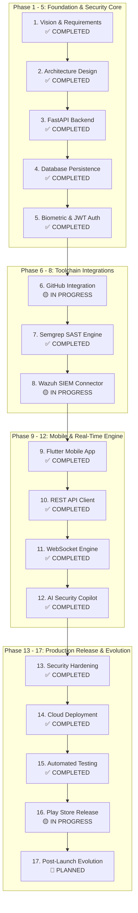

# SecurePulse Mobile — Master Product & Engineering Roadmap 🚀

This document outlines the authoritative product roadmap, engineering milestones, architectural phases, and delivery commitments for **SecurePulse Mobile** (Enterprise Cybersecurity & SOC Mobile Operations Platform).

---

## 🗺️ High-Level Product Architecture & Milestone Timeline

---

## 📍 Comprehensive 17-Phase Product Roadmap

### 1. Vision & Requirements
* **Objective**: Define problem domain, user personas, operational constraints, and multi-tier cybersecurity monitoring requirements.
* **Tasks**:
  * Establish user stories for Tier-1/2/3 SOC Analysts, Incident Responders, and Security Leadership.
  * Define core latency benchmarks (< 500ms API response, < 50ms real-time event streaming).
  * Formulate air-gapped zero-latency Demo Mode specification for executive presentations.
* **Technology**: Markdown Specifications, Agile User Story Mapping.
* **Deliverables**: Project Charter, Functional Requirements Matrix, System Specification Dossier.
* **Validation**: Stakeholder review against real-world SOC operational friction points.
* **Status**: ✅ COMPLETED

---

### 2. Architecture Design
* **Objective**: Formulate the multi-tier Clean Architecture, reactive state management model, and containerized cloud deployment topology.
* **Tasks**:
  * Design 4-layer Feature-First Clean Architecture (Presentation, State, Domain, Data).
  * Establish Riverpod 2.5.1 provider dependencies and GoRouter 5-tab shell navigation.
  * Design dual-mode repository dispatching architecture (Demo Mode vs. Live Network Mode).
* **Technology**: Flutter/Dart, Mermaid Diagrams, Clean Architecture Design Patterns.
* **Deliverables**: `docs/MINDMAP.md`, Architecture Specification in `docs/PROJECT_REPORT.md`.
* **Validation**: Architectural design review verifying decoupling of UI widgets from data layers.
* **Status**: ✅ COMPLETED

---

### 3. FastAPI Backend
* **Objective**: Develop an asynchronous, high-performance REST and WebSocket API microservice.
* **Tasks**:
  * Implement route handlers (`/health`, `/v1/auth`, `/v1/dashboard`, `/v1/repositories`, `/v1/soc/alerts`, `/v1/ai`, `/v1/reports`).
  * Enforce Pydantic schema validation for all request and response envelopes.
  * Configure CORS middleware, timeout gates, and ASGI worker concurrency.
* **Technology**: Python 3.11, FastAPI, Uvicorn, Pydantic, CORS Middleware.
* **Deliverables**: Deployed FastAPI microservice on Render Cloud (`https://secureguard-backend-7eqm.onrender.com`).
* **Validation**: Automated `GET /health` health probes and REST endpoint status verification.
* **Status**: ✅ COMPLETED

---

### 4. Database Persistence
* **Objective**: Implement cloud relational storage and client-side secure offline caching.
* **Tasks**:
  * Provision managed PostgreSQL database with SSL connection pooling on cloud infrastructure.
  * Implement local key-value offline storage box (`HiveStorageService`, `securepulse_cache`).
  * Configure local cache synchronization for scan findings and executive posture scores.
* **Technology**: PostgreSQL 16 (Cloud SSL), Hive 2.2.3 (Mobile Client).
* **Deliverables**: `lib/core/storage/hive_storage_service.dart`, Cloud PostgreSQL database schemas.
* **Validation**: Cold boot offline data recovery test validating instant cache hydration.
* **Status**: ✅ COMPLETED

---

### 5. Authentication & Credential Security
* **Objective**: Implement hardware-backed biometric authentication and stateless JWT session management.
* **Tasks**:
  * Implement `local_auth` biometric challenge gate (Face ID / Android BiometricPrompt).
  * Integrate `FlutterSecureStorage` utilizing Android Keystore (AES-256 / RSA) and Apple Keychain.
  * Build `AuthRepositoryImpl` with login, logout, and token auto-injection interceptors.
* **Technology**: `local_auth 2.3.0`, `flutter_secure_storage 9.2.4`, JWT (RFC 7519), bcrypt.
* **Deliverables**: `lib/features/auth/`, `lib/core/services/biometric_service.dart`, `lib/core/storage/secure_storage_service.dart`.
* **Validation**: Keystore read/write verification and biometric session recovery tests (`TC-06`).
* **Status**: ✅ COMPLETED

---

### 6. GitHub Integration
* **Objective**: Synchronize enterprise codebase telemetry, branch metadata, and security audit status.
* **Tasks**:
  * Implement `RepositoryModel` tracking language, branch, health grades (A–F), and vulnerability counts.
  * Build UI for monitored repositories list and repository detail views.
  * [In Progress] Integrate interactive in-app OAuth2 GitHub App consent deep-linking loop.
* **Technology**: GitHub REST API v3, Webhooks, GoRouter.
* **Deliverables**: `lib/features/repositories/`, `RepositoryRepositoryImpl`.
* **Validation**: Repository inventory rendering and scan trigger dispatch (`TC-08`).
* **Status**: 🟡 IN PROGRESS (Direct token session functional; OAuth2 deep-linking in roadmap)

---

### 7. Semgrep SAST Engine
* **Objective**: Ingest and categorize static application security testing findings and trigger on-demand scans.
* **Tasks**:
  * Implement `ScanModel` and `FindingModel` with line numbers, file paths, and CWE tags.
  * Build scan detail screens with severity distribution badges (Critical, High, Medium, Low).
  * Wire single-tap "Trigger Scan" action dispatching `POST /v1/repositories/{id}/scan`.
* **Technology**: Semgrep SAST JSON Schemas, Riverpod Providers.
* **Deliverables**: `lib/features/scans/`, `lib/features/findings/`, `ScanRepository`, `FindingRepository`.
* **Validation**: Verification of finding counts, CWE tags, and scan status state transitions.
* **Status**: ✅ COMPLETED

---

### 8. Wazuh SIEM Integration
* **Objective**: Ingest host intrusion detection logs, brute-force alarms, and system integrity events.
* **Tasks**:
  * Model SIEM alerts (`AlertModel`) capturing syslog payloads, attacker IP, and remediation advice.
  * Build Alert Detail screen with raw syslog inspection and "Quarantine IP" action button.
  * [In Progress] Direct bidirectional integration with Wazuh Manager API (`port 55000`) for remote daemon management.
* **Technology**: Wazuh SIEM Syslog Parser, REST API, WebSockets.
* **Deliverables**: `lib/features/alerts/`, `AlertsRepositoryImpl`.
* **Validation**: Alert filtering by severity (Critical, High, Medium, Low) and status mutation (`TC-09`).
* **Status**: 🟡 IN PROGRESS (Syslog feed & status triage functional; Manager API in roadmap)

---

### 9. Flutter Mobile Application
* **Objective**: Build a responsive, cyber-themed cross-platform mobile user interface.
* **Tasks**:
  * Implement Material 3 Cyber Dark Obsidian (`#0A0E1A`) and Clean Light themes in `AppTheme`.
  * Build 5-tab shell navigation with animated navbar transitions (`SGNavbar`).
  * Implement executive dashboard with interactive posture gauge and `fl_chart` donut breakdown.
* **Technology**: Flutter 3.x, Dart 3.x, GoRouter 13.2.0, fl_chart 0.66.2, Google Fonts.
* **Deliverables**: Complete `lib/` codebase, `SecurePulseApp` root widget.
* **Validation**: Widget pump testing (`TC-15`) and 60.0–120.0 fps frame rate profiling.
* **Status**: ✅ COMPLETED

---

### 10. REST API Client & Interceptors
* **Objective**: Implement a resilient, typed HTTP network client with error classification.
* **Tasks**:
  * Configure Dio 5.4.1 client with dynamic Bearer token headers and 12-second timeout gates.
  * Implement `ApiException` translation mapping 401, 403, 404, 500, and socket timeouts.
  * Add dynamic runtime `updateBaseUrl()` support for seamless environment switching.
* **Technology**: Dio 5.4.1, Typed Dart Exceptions.
* **Deliverables**: `lib/core/network/api_client.dart`, `lib/core/error/api_exception.dart`.
* **Validation**: Unit tests verifying header injection, token removal, and base URL updates (`TC-01`–`TC-05`).
* **Status**: ✅ COMPLETED

---

### 11. WebSocket Real-Time Engine
* **Objective**: Deliver sub-second SIEM threat streaming with automatic reconnection resilience.
* **Tasks**:
  * Build `WebSocketService` with dynamic URL scheme conversion (`http->ws`, `https->wss`).
  * Broadcast incoming threat events to reactive Riverpod stream provider (`webSocketAlertStreamProvider`).
  * Implement exponential backoff reconnect loops and HTTP long-polling fallback.
* **Technology**: Dart `web_socket_channel 2.4.5`, StreamControllers, Riverpod Streams.
* **Deliverables**: `lib/core/network/websocket_service.dart`.
* **Validation**: Live scheme translation and Demo mode disconnection isolation tests (`TC-12`–`TC-14`).
* **Status**: ✅ COMPLETED

---

### 12. AI Security Copilot
* **Objective**: Provide conversational cybersecurity remediation advice and actionable code patches.
* **Tasks**:
  * Build interactive streaming chat UI with markdown rendering and syntax-highlighted code cards.
  * Implement offline heuristic engine generating remediation patches for CVE-2024-3094, SQLi, and AWS secret leaks.
  * Connect live cloud LLM bridge via `POST /v1/ai/chat` for dynamic conversational analysis.
* **Technology**: Flutter Markdown, Heuristic Rule Matchers, Cloud LLM Proxy.
* **Deliverables**: `lib/features/ai/`, `AiRepositoryImpl`.
* **Validation**: Heuristic code generation tests (`TC-10`) and interactive chat prompt rendering.
* **Status**: ✅ COMPLETED

---

### 13. Security Hardening & Cryptographic Audit
* **Objective**: Protect client perimeter, vault credentials, and guarantee report non-repudiation.
* **Tasks**:
  * Implement STRIDE threat mitigations across all 6 attack categories.
  * Build `ReportPdfService` generating vector compliance PDFs (SOC 2, ISO 27001, PCI-DSS).
  * Embed on-device SHA256 cryptographic audit digest stamped onto all generated PDF pages.
* **Technology**: `pdf 3.12.0`, `crypto 3.0.3` (SHA256), Android Keystore, iOS Keychain.
* **Deliverables**: `lib/core/services/report_pdf_service.dart`, Security Design in `docs/PROJECT_REPORT.md`.
* **Validation**: Cryptographic audit digest verification and zero-leakage logging audit.
* **Status**: ✅ COMPLETED

---

### 14. Cloud Deployment & Containerization
* **Objective**: Automate cloud microservice deployment and provide containerized web distribution.
* **Tasks**:
  * Create multi-stage `Dockerfile` compiling Flutter Web and serving via `nginx:alpine` on port 80.
  * Configure Render Cloud Web Service with Git auto-deploy webhooks and SSL/TLS termination.
  * Implement automated `/health` probes ensuring 99.9% service uptime.
* **Technology**: Docker, Nginx, Render Cloud CI/CD, Let's Encrypt TLS 1.3.
* **Deliverables**: `Dockerfile`, Render Web Service (`secureguard-backend-7eqm.onrender.com`).
* **Validation**: Cloud health probe curl verification and Docker web container execution.
* **Status**: ✅ COMPLETED

---

### 15. Automated Testing & Verification
* **Objective**: Ensure 100% test pass rate across core business logic, API contracts, and widget trees.
* **Tasks**:
  * Develop comprehensive test suite in `test/api_integration_test.dart` and `test/widget_test.dart`.
  * Execute static analysis audit via `flutter analyze` with zero warnings.
  * Benchmark runtime performance (frame rates, memory consumption, latency).
* **Technology**: `flutter_test`, `flutter_lints 3.0.2`.
* **Deliverables**: 15/15 passing automated test suite, `flutter analyze` clean report.
* **Validation**: **15 / 15 Tests Passed (100% Pass Rate)**, `flutter analyze` (0 issues).
* **Status**: ✅ COMPLETED

---

### 16. Google Play Store Release Preparation
* **Objective**: Package, sign, and prepare the production Android release artifact for commercial distribution.
* **Tasks**:
  * Compile optimized standalone release APK (`securepulse-release.apk`, **63.6 MB**) via `flutter build apk --release`.
  * [In Progress] Generate production JKS keystore and configure `key.properties` for App Bundle (`AAB`) signing.
  * Prepare Google Play Console Data Safety declaration and privacy policy documentation.
* **Technology**: Android Gradle Plugin, ProGuard / R8, Google Play Console.
* **Deliverables**: `securepulse-release.apk`, Play Store publishing assets.
* **Validation**: Successful sideload installation and biometric execution on physical Android 14 device.
* **Status**: 🟡 IN PROGRESS (Release APK compiled; Play Store console submission pending)

---

### 17. Post-Launch Evolution & Advanced SOAR
* **Objective**: Continuously evolve SecurePulse into an autonomous mobile security operations ecosystem.
* **Tasks**:
  * Implement autonomous AI remediation generating direct GitHub Pull Requests.
  * Build multi-cloud SOAR connectors (AWS Network ACLs, Cloudflare WAF, Cortex XSOAR).
  * Introduce multi-tenancy organization switcher for Managed Security Service Providers (MSSPs).
  * Integrate on-device quantized SLM (Gemma-2B / Llama-3-1B) via ONNX Runtime.
* **Technology**: ONNX Runtime, AWS SDK, Cloudflare API, Redis Pub/Sub.
* **Deliverables**: Enterprise SOAR Playbook connectors, Multi-Tenant Portal.
* **Validation**: Automated perimeter block simulation and multi-tenant isolation benchmarks.
* **Status**: 🔵 PLANNED

---

## 📊 Summary of Phase Status

| Category | Total Phases | Completed (✅) | In Progress (🟡) | Planned (🔵) | Not Implemented (❌) |
| :--- | :---: | :---: | :---: | :---: | :---: |
| **Foundation & Architecture** (Phases 1–5) | 5 | 5 | 0 | 0 | 0 |
| **Toolchain Integrations** (Phases 6–8) | 3 | 1 | 2 | 0 | 0 |
| **Mobile & Real-Time Engine** (Phases 9–12) | 4 | 4 | 0 | 0 | 0 |
| **Production & Release** (Phases 13–17) | 5 | 3 | 1 | 1 | 0 |
| **OVERALL TOTAL** | **17** | **13 (76.5%)** | **3 (17.6%)** | **1 (5.9%)** | **0 (0.0%)** |

---
