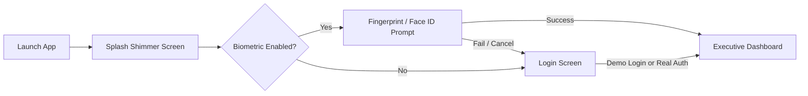

# SecurePulse Mobile — End-to-End Walkthrough & Operations Guide 📖

This guide provides a comprehensive walkthrough of the **SecurePulse Mobile** application for security analysts, incident responders, administrators, and developers.

---

## 🚀 1. Application Launch & Authentication

### Steps:
1. **Splash Screen**: On cold boot, the app displays the SecurePulse holographic cyber shield with smooth entrance animations and initializes the encrypted Hive storage, Push notification handlers, and cached user preferences.
2. **Biometric Challenge**: If enabled in settings, the OS biometric gate prompts for instant authentication.
3. **Login Options**:
   - **Demo Login**: Tap "Enter as Security Analyst (Demo Mode)" for instant access without network setup.
   - **Production Login**: Enter enterprise credentials (`email` and `password`) to obtain an authenticated JWT from the FastAPI backend.

---

## 📊 2. Executive Security Dashboard (Tab 1)

The home dashboard is an executive-level overview of real-time organizational security posture.

### Key Components:
* **Security Posture Score**: Circular animated gauge displaying the composite security score (e.g., **94/100 • Grade A+**).
* **Live System Status Badges**:
  * `Cloud API`: Connection status to Render FastAPI server.
  * `WebSocket`: Real-time incident stream status.
  * `GitHub SAST`: Codebase sync status.
  * `AI Engine`: LLM security assistant readiness.
* **Vulnerability Breakdown Chart**: Interactive `fl_chart` donut graph categorizing Critical, High, Medium, and Low vulnerabilities.
* **Quick Action Dock**:
  * 🔍 *Trigger SAST Scan*
  * ⚡ *SOC Alert Triage*
  * 🤖 *Ask AI Security Copilot*
  * 📄 *Export Compliance PDF*

---

## 🔍 3. Repositories & SAST Security Audits (Tab 2)

Monitors enterprise source code repositories for security vulnerabilities, secrets leakage, and misconfigurations.

### Workflow:
1. **Repository List**: Displays repositories (e.g., `secureguard-mobile`, `secureguard-backend`, `payment-gateway`).
2. **Repository Detail**:
   - Primary language, branch, commit SHA, and overall security rating.
   - Scan history with timestamps and finding tallies.
   - **"Trigger Immediate SAST Scan"** button: Initiates Semgrep static analysis across the codebase.
3. **Findings Drilldown**:
   - Filter by severity: **Critical**, **High**, **Medium**, **Low**.
   - Tap any finding to view the exact code snippet, line number, CVE reference, CWE classification, and remediation guidance.

---

## 🤖 4. AI Security Copilot (`SecurePulse AI`) (Tab 3)

An interactive conversational assistant trained on cybersecurity frameworks (SOC 2 Type II, ISO/IEC 27001, PCI-DSS, NIST CSF) and incident response playbooks.

### Sample Prompts & Capabilities:
* **CVE Explanation**: *"Explain CVE-2024-3094 and provide the patch instructions for Debian/Ubuntu."*
* **Remediation Code**: *"Generate a secure FastAPI CORS policy with strict origin validation."*
* **Firewall Rules**: *"Write iptables and ufw rules to mitigate DDoS SYN flood on port 443."*
* **Compliance Queries**: *"What are the required controls for SOC 2 Type II CC6.1 logical access controls?"*

---

## ⚡ 5. SOC Threat Stream & Incident Alerts (Tab 4)

Real-time SIEM incident management powered by WebSockets.

### Alert Investigation Workflow:
1. **Live Incident Feed**: Chronological list of real-time security events (e.g., *Brute Force Detection on SSH*, *SQL Injection Attempt*, *Unauthorized IAM Privilege Escalation*).
2. **Filtering**: Instant filtering by severity level and status (Active, In Progress, Resolved).
3. **Incident Detail View**:
   - Source: Wazuh SIEM, CloudTrail, or Snort IDS.
   - Attacker IP, Destination Port, and Geographic Origin.
   - Full JSON payload and raw syslog stream.
   - Action buttons: **"Acknowledge Alert"**, **"Quarantine IP"**, and **"Generate Incident Report"**.

---

## 📄 6. Executive Compliance Reports & PDF Export

Generate cryptographically signed compliance reports directly to the mobile file system or share sheet.

### Supported Frameworks:
* **SOC 2 Type II** (Trust Services Criteria CC6.1 - CC8.1)
* **ISO/IEC 27001:2022** (Information Security Management)
* **PCI-DSS v4.0** (Payment Card Industry Security Standards)
* **HIPAA Security Rule** (Healthcare Protected Health Information)

### Export Features:
* Cryptographic SHA256 audit fingerprint included on every page.
* One-tap export via Android/iOS Share Sheet (Email, Slack, WhatsApp, Google Drive, AirDrop).

---

## ⚙️ 7. Settings & Environment Diagnostics (Tab 5)

Complete diagnostic and configuration control center.

### Configuration Controls:
* **Environment Switcher**:
  * 🌐 *Render Cloud* (`https://secureguard-backend-7eqm.onrender.com`)
  * 📱 *Android Emulator Loopback* (`http://10.0.2.2:8000`)
  * 💻 *Localhost* (`http://127.0.0.1:8000`)
  * 🛠️ *Custom URL Input*
* **Demo Mode Toggle**: One-tap switch between offline simulation and live backend.
* **Biometric Auth Toggle**: Turn Face ID / Fingerprint lock on or off.
* **Theme Selector**: Toggle between Cyber Dark and Clean Light modes.
* **Network Diagnostics**: Real-time HTTP ping test and WebSocket handshake validation.
